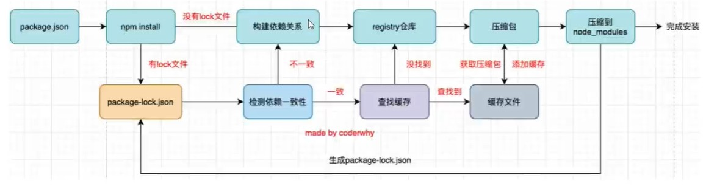
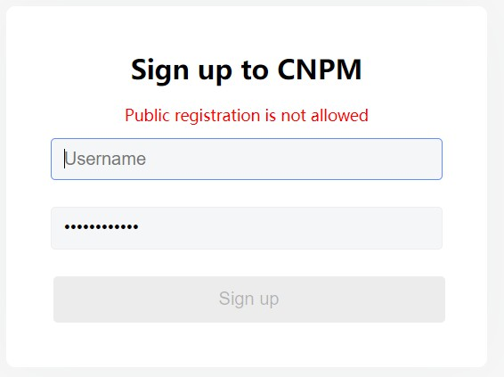

# 包管理工具

## 一、npm包管理工具

### 1. 介绍

* Node Package Manager就是Node包管理工具
*  但是目前已经不仅仅是Node包管理器了，在前端项目中我们也在使用它来管理依赖的包;

### 2.  [npm管理的包](https://www.npmjs.com/)

 	1. 发布包到的位置是registry仓库上

### 3. npm的使用

**查看npm镜像**

```
npm config get registry
```

**设置npm镜像**

```
npm config set registry https://registry.npm.taobao.org

注意:
 *不太希望随意修改npm原本从官方下来包的渠道;
 *担心某天淘宝的镜像挂了或者不维护了，又要改来改去;
```


**安装依赖包**

```json
//默认安装开发和生产依赖
npm install axios
npm i axios

//开发依赖
npm install webpack --save-dev
npm install webpack -D
npm i webpack -D

//根package.json中安装依赖包
npm install

//下载指定版本
npm install webpack@3.6.0

//全局安装
npm install webpack -g
```

**卸载依赖包**

```json
npm uninstall package 
npm uninstall package --save-dev
npm uninstall package -D
```

**强制重新构建依赖**

```
npm rebuild
```

**清除缓存**

```
npm cache clean
```

**删除node_modules**

```
rm -rf node_modules
```

 **获取缓存文件夹位置**

```
npm config get cache
```

**npm的命令地址**

https://docs.npmjs.com/cli/v11/commands

### 4. npm的配置文件(package.json)

```json
{
  "name": "package", // 项目名称
  "version": "1.0.0", // 版本号
  "description": "",  // 项目描述信息
  "author": "",   // 作者信息
  "license": "ISC", // 开源协议
  "private":"false", // 当前项目是否是私有的, 值为true时是不能发布npm的,防范项目或模块误发npm。默认值为true
  "main": "index.js", // 设置入口文件,使用模块时就会根据main属于查找对应的文件
  "scripts": { // 配置一些脚本命令，以键值对的形式存在。配置的命令可以用npm run 键值 来执行 例子(npm run test)
    "test": "echo \"Error: no test specified\" && exit 1"
  },
  "keywords": [],
  "dependencies": { // 所安装的依赖信息(开发和生产环境都需要的)

  },
  "devDependencies": {// 所安装的依赖信息(开发环境需要的)

  },
  "peerDependencies": { // 用于提示当前代码开发时使用的其他依赖的包

  },
  "engines": {}, //用于指定node或npm版本
  "browserslist":{}, // 配置打包后的JavaScript浏览器的兼容情况
  "homepage": "", //官网地址
  "repository": { // 配置源码仓库
    "type": "git", 
    "url": ""
  },
}

```

#### 属性

**dependencies**

*  dependencies属性是指定无论开发环境还是生成环境都需要依赖的包;
* 通常是我们项目实际开发用到的一些库模块vue、vuex、vue-router、react、react-dom、axios等等

**devDependencies**

* 一些包在生成环境是不需要的，比如webpack、babel等;
* 这个时候我们会通过 npm install webpack --save-dev，将它安装到devDependencies属性中

**peerDependencies**

* 还有一种项目依赖关系是对等依赖，也就是你依赖的一个包，它必须是以另外一个宿主包为前提的;
* 比如element-plus是依赖于vue3的，ant design是依赖于react、react-dom;

**engines**(了解)

* engines属性用于指定Node和NPM的版本号
*  在安装的过程中，会先检查对应的引擎版本，如果不符合就会报错；
* 事实上也可以指定所在的操作系统"os":["darwin""linux"1，只是很少用到；

**browserslist**(了解)

*  用于配置打包后的JavaScript浏览器的兼容情况，参考;
* 否则我们需要手动的添加polyfils来让支持某些语法；
* 也就是说它是为webpack等打包,工具服务的一个属性(这里不是详细讲解webpack等工具的工作原理，所以不再给出详情);


#### 创建配置文件方法

* 方法一：npm init -y   // 手动创建项目
* 方法二：通过脚手架创建

### 5. 依赖的版本管理

#### 		1 介绍

* npm的包通常需要遵从semver版本规范

* semver:https://semverorg/lang/zh-CN/

* npm semver:https://docs.npmjs.com/misc/semver


####       2 semver版本规范是X.Y.Z:

​	例子:"vue":"^2.2.0"

* X主版本号(major):当你做了不兼容的 API修改(可能不兼容之前的版本);
* Y次版本号(minor):当你做了向下兼容的功能性新增(新功能增加，但是兼容之前的版本);
* Z修订号(patch):当你做了向下兼容的问题修正(没有新功能，修复了之前版本的bug);

####       3 版本中^和~区别

* x.y.z:表示一个明确的版本号
* ^x.y.z:表示x是保持不变的，y和z永远安装最新的版本;
* ~x.y.z:表示x和y保持不变的，z永远安装最新的版本,

### 6. package-lock.json(配置文件)

```json
{
  "name": "Package",
  "lockfileVersion": 3,
  "requires": true,
  "packages": {
    "": {
      "dependencies": {
        "axios": "^1.9.0"
      }
    },
	"node_modules/axios": {
      "version": "1.9.0",
      "resolved": "https://registry.npmmirror.com/axios/-/axios-1.9.0.tgz",
      "integrity": "sha512-re4CqKTJaURpzbLHtIi6XpDv20/CnpXOtjRY5/CU32L8gU8ek9UIivcfvSWvmKEngmVbrUtPpdDwWDWL7DNHvg==",
      "dependencies": {
        "follow-redirects": "^1.15.6",
        "form-data": "^4.0.0",
        "proxy-from-env": "^1.1.0"
      }
    },
}
```

属性

* **name**:项目的名称;
* **version**:项目的版本;
* **lockfileVersion**:lock文件的版本;
* **requires/dependencies**:来跟踪模块的依赖关系
* **dependencies**:项目的依赖
  * 当前项目依赖axios，但是axios依赖follow-redireacts;
  * axios中的属性如下
    *  version表示实际安装的axios的版本
    * resolved用来记录下载的地址，registry仓库中的位置;
    * requires/dependencies记录当前模块的依赖;
    * integrity用来从缓存中获取索引，再通过索引去获取压缩包文件

### 7. npm install 命令

​	**安装npm包分两种情况:**

* **全局安装(global install)**:  npm install  webpack  -g;

* **项目(局部)安装**(localinstall):  npm install  webpack

​    **全局安装**

* 全局安装是直接将某个包安装到全局:

​	**注意**

* 通常使用**npm全局安装的包都是一些工具包**:yarn、webpack等
* **并不是类似于 axios、express、koa等库文件**;
* 所以全局安装了之后并不能让我们在所有的项目中使用 axios等库;

### 8. npm install 原理



**npm install会检测是有package-lock.json文件**

* 没有lock文件
  *  分析依赖关系，这是因为我们可能包会依赖其他的包，并且多个包之间会产生相同依赖的情况;
  *  从registry仓库中下载压缩包(如果我们设置了镜像，那么会从镜像服务器下载压缩包);
  *  获取到压缩包后会对压缩包进行缓存(从npm5开始有的);
  *  将压缩包解压到项目的node modules文件夹中(前面我们讲过，require的查找顺序会在该包下面查找)
* 有lock文件
  * 检测lock中包的版本是否和package.json中一致(会按照semver版本规范检测);
    * 不一致，那么会重新构建依赖关系，直接会走顶层的流程;
  * 一致的情况下，会去优先查找缓存
    * 没有找到，会从registry仓库下载，直接走顶层流程;
  * 查找到，会获取缓存中的压缩文件，并且将压缩文件解压到node modules文件夹中;

## 二、yarn工具

### 1. 介绍

* 另一个node包管理工具yarn:
  * yarn是由Facebook、Google、Exponent 和 Tilde 联合推出了一个新的 JS 包管理工具;
  * yarn 是为了弥补 早期npm 的一些缺陷而出现的;
  *  早期的npm存在很多的缺陷，比如安装依赖速度很慢、版本依赖混乱等等一系列的问题;
  *  虽然从npm5版本开始，进行了很多的升级和改进，但是依然很多人喜欢使用yarn;

### 2. 安装及使用

**安装yarn**

```
npm i yarn -g//全局安装yarn
```


**安装依赖包**

```json
//默认安装开发和生产依赖
yarn add package

//开发依赖
yarn add package -dev
yarn add package -D

//根package.json中安装依赖包
npm install
```

**卸载依赖包**

```json
yarn remove package
```

**强制重新构建依赖**

```
npm rebuild
```

**清除缓存**

```
yarn cache clean
```

**删除node_modules并重新安装依赖**

```
yarn upgrade
```

## 三、cnpm工具

### 1. 使用

**下载依赖**

```
npm i cnpm -g  
npm i cnpm -g --registry=https://registry.npm.taobao.org //下载依赖并设置淘宝镜像
```

**查看镜像**

```
cnpm config get registry
```

**设置镜像**

```
cnpm config set registry=https://registry.npm.taobao.org
```

**下载依赖**

```
cnpm i axios
```

## 四、 npx使用

### 1. 介绍

* npx是npm5.2之后自带的一个命令。
* npx比较常见的使用它来调用项目中的某个模块的指令

### 2. 使用项目(局部)的webpack，常见的是两种方式

* **方式一**: 在终端中使用如下命令(在项目根目录下)
  * ./node modules/.bin/webpack --version
* **方式二:**  修改package.json中的scripts

```
"scripts":{
	"webpack":"webpack --version"
}
```

* **方式三:**  使用npx

  ```
  npx webpack --version
  ```

  * npx的原理非常简单，它会到当前目录的node modules/.bin目录下查找对应的命令;

## 五、发布包并使用

### 1. 发布

**注册账号**

* [地址](https://www.npmjs.com/)
* 选择sign up注册

**登录npm**

* 命令行 npm login
* **注意登录时报错**



* 操作步骤
  * cmd 执行  npm config set registry https://registry.npmjs.org
  * 发布完后 切换:npm config set registry https://registry.npmmirror.com，避免npm install报错

**发布**

* npm publish

**修改并重新发布**

* 更改版本号

  * 方法一：直接在package.json修改

  ```
  {
      "name": "123",
      "version": "1.0.1",
      // 其他字段保持不变
  }
  ```

  * 方法二:

  ```
  // 升级补丁版本号，例如从 1.0.0 升级到 1.0.1
  npm version patch
  
  // 升级次版本号，例如从 1.0.0 升级到 1.1.0
  npm version minor
  
  //升级主版本号，例如从 1.0.0 升级到 2.0.0
  npm version major
  
  ```

* 重新发布

  ```
  npm publish
  ```

**删除发布的包**

* npm unpublish

**让发布的包过期**

* npm deprecate

