# 基础知识

## 事件循环

### 1. 浏览器的进程模型

#### 	1.1 进程介绍

```
程序运行需要有它自己专属的内存空间，可以把这块内存空间简单的理解为进程

每个应用至少有一个进程，进程之间相互独立，即使要通信，也需要双方同意
```

#### 	1.2 线程介绍

```
* 进程后，就可以运行程序的代码了。
* 代码的「人」称之为「线程」。
* 一个进程至少有一个线程，所以在进程开启后会自动创建一个线程来运行代码，该线程称之为主线程。
* 如果程序需要同时执行多块代码，主线程就会启动更多的线程来执行代码，所以一个进程中可以包含多个线程。
```

####  	1.3 浏览器介绍

```
* 浏览器是一个多进程多线程的应用程序
* 浏览器内部工作极其复杂。
* 为了避免相互影响，为了减少连环崩溃的几率，当启动浏览器后，它会自动启动多个进程。
```

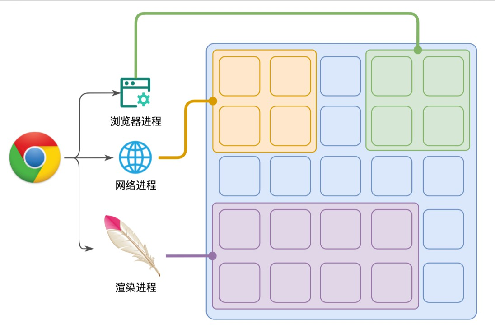   

##### 1.3.1 进程介绍

```
1.浏览器进程
  主要负责界面显示、用户交互、子进程管理等。浏览器进程内部会启动多个线程处理不同的任务。
2.网络进程
  负责加载网络资源。网络进程内部会启动多个线程来处理不同的网络任务。
3.渲染进程
  渲染进程启动后，会开启一个渲染主线程，主线程负责执行 HTML、CSS、JS 代码。
  默认情况下，浏览器会为每个标签页开启一个新的渲染进程，以保证不同的标签页之间不相互影响。
```

##### 1.3.2可以在浏览器的任务管理器中查看当前的所有进程

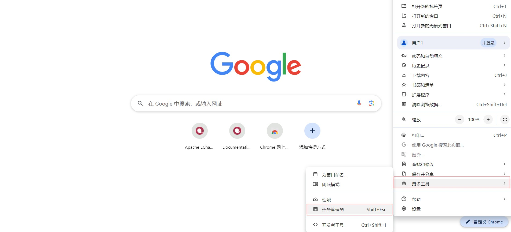

#### 1.4 渲染主线程作用

```
渲染主线程是浏览器中最繁忙的线程，需要它处理的任务包括但不限于：
  解析 HTML、解析 CSS、计算样式、布局、处理图层、每秒把页面画 60 次、执行全局 JS 代码、执行事件处理函数、执行计时器的回调函数
```

#### 1.5 主线程渲染过程

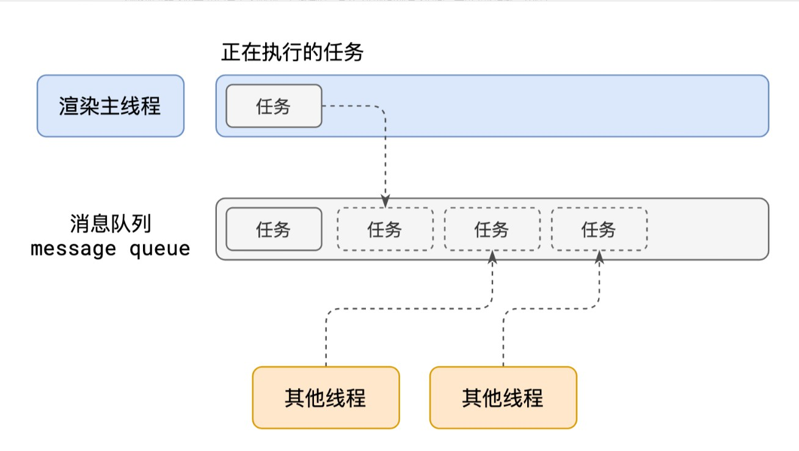

```
1.在最开始的时候，渲染主线程会进入一个无限循环
2.每一次循环会检查消息队列中是否有任务存在。如果有，就取出第一个任务执行，执行完一个后进入下一次循环；如果没有，则进入休眠状态。
3.其他所有线程（包括其他进程的线程）可以随时向消息队列添加任务。新任务会加到消息队列的末尾。在添加新任务时，如果主线程是休眠状态，则会将其唤醒以继续循环拿取任务，这样一来，就可以让每个任务有条不紊的、持续的进行下去了。整个过程，被称之为事件循环（消息循环）
```

### 2. 异步

#### 	2.1. 介绍

```
代码在执行过程中，会遇到一些无法立即处理的任务。
```

#### 	2.2 例子

```
计时完成后需要执行的任务 —— setTimeout、setInterval
网络通信完成后需要执行的任务 – XHR、Fetch
用户操作后需要执行的任务 – addEventListener
```

####     2.3. 使用异步的原因

   如果让渲染主线程等待这些任务的时机达到，就会导致主线程长期处于「阻塞」的状态，从而导致浏览器「卡死」。

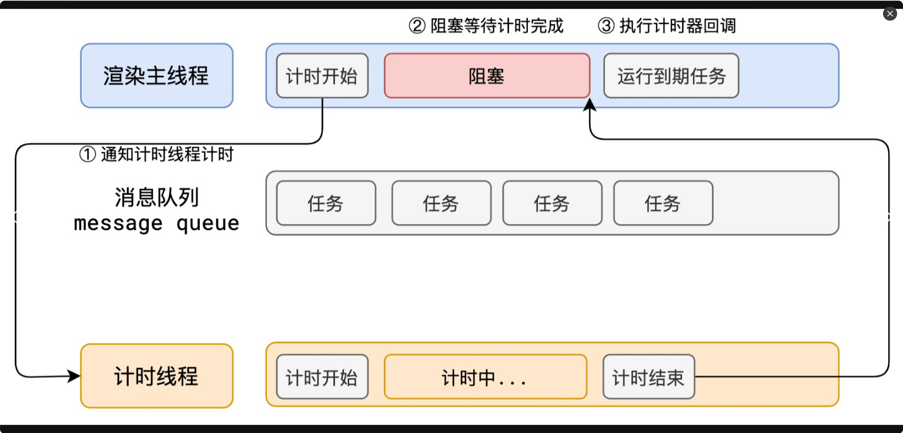

​	渲染主线程承担着极其重要的工作，无论如何都不能阻塞！

​	因此，浏览器选择异步来解决这个问题

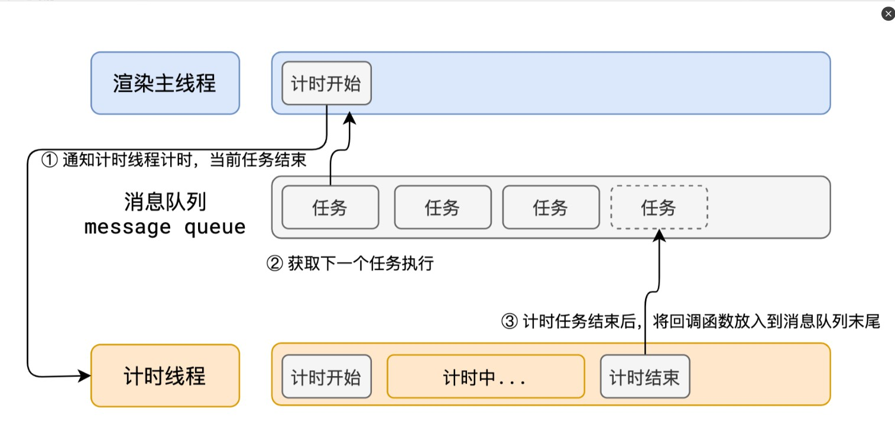

​	使用异步的方式，渲染主线程永不阻塞

### 	3. 任务介绍

```
* 任务没有优先级，在消息队列中先进先出。但消息队列是有优先级的。
* 根据W3C的最新解释:
    每个任务都有一个任务类型，同一个类型的任务必须在一个队列，不同类型的任务可以分属于不同的队列。
    在一次事件循环中，浏览器可以根据实际情况从不同的队列中取出任务执行。
    浏览器必须准备好一个微队列，微队列中的任务优先所有其他任务执行
* 随着浏览器的复杂度急剧提升，W3C 不再使用宏队列的说法
* 在目前 chrome 的实现中，至少包含了下面的队列：
    延时队列：用于存放计时器到达后的回调任务，优先级「中」
    交互队列：用于存放用户操作后产生的事件处理任务，优先级「高」
    微队列：用户存放需要最快执行的任务，优先级「最高」
    
添加任务到微队列的主要方式主要是使用 Promise、MutationObserver
例子:Promise.resolve().then(函数)
```

###    4.总结

```
单线程是异步产生的原因
事件循环是异步的实现方法
```

## 浏览器渲染原理

### 1.浏览器是如何渲染页面的

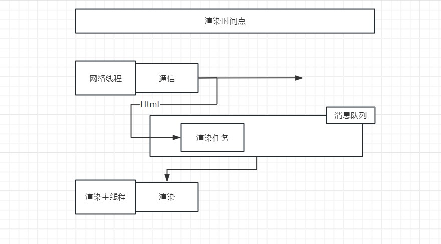

当浏览器的网络线程收到 HTML 文档后，会产生一个渲染任务，并将其传递给渲染主线程的消息队列。

在事件循环机制的作用下，渲染主线程取出消息队列中的渲染任务，开启渲染流程。

整个渲染流程分为多个阶段，分别是： HTML 解析、样式计算、布局、分层、绘制、分块、光栅化、画

每个阶段都有明确的输入输出，上一个阶段的输出会成为下一个阶段的输入。

这样，整个渲染流程就形成了一套组织严密的生产流水线。

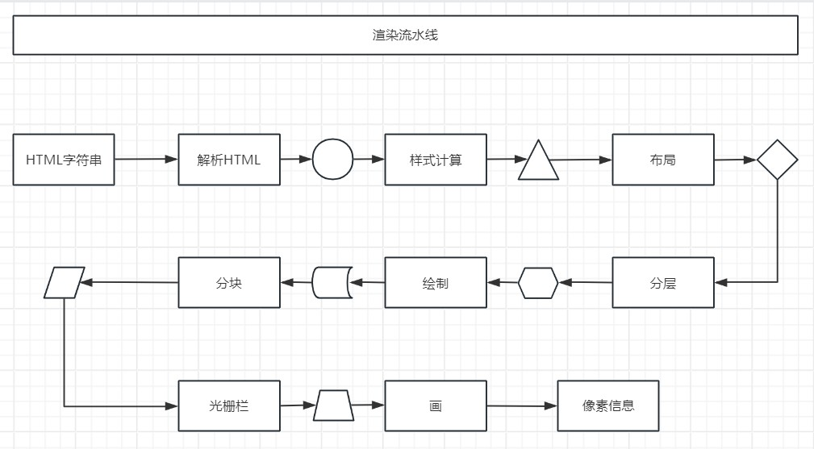

**渲染的第一步是解析 HTML。**

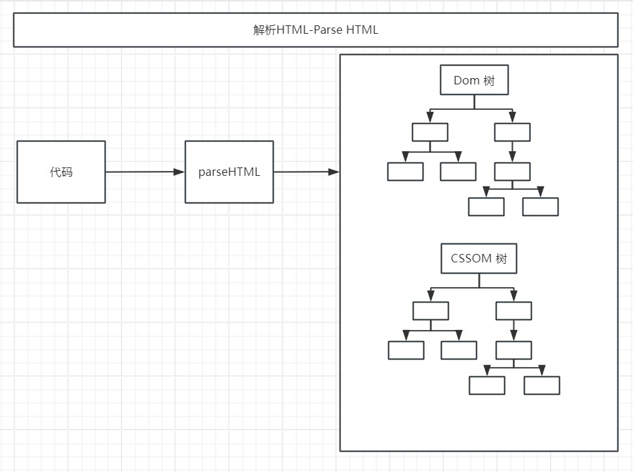

解析过程中遇到 CSS 解析 CSS，遇到 JS 执行 JS。为了提高解析效率，浏览器在开始解析前，会启动一个预解析的线程，率先下载 HTML 中的外部 CSS 文件和 外部的 JS 文件。

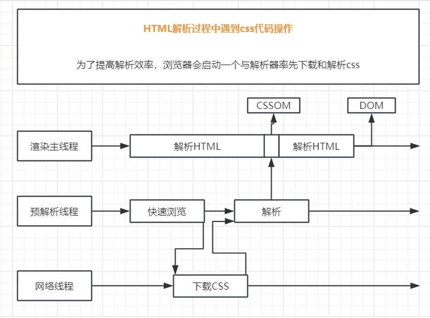

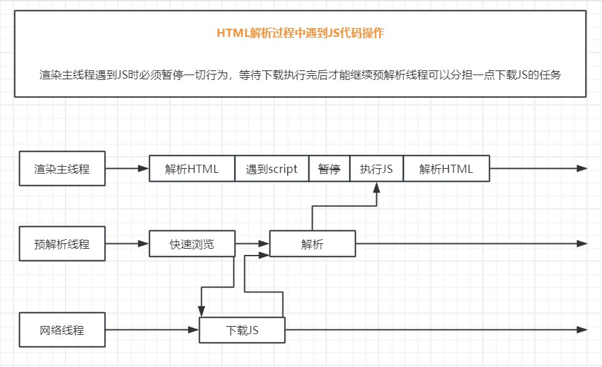

如果主线程解析到link位置，此时外部的 CSS 文件还没有下载解析好，主线程不会等待，继续解析后续的 HTML。这是因为下载和解析 CSS 的工作是在预解析线程中进行的。这就是 CSS 不会阻塞 HTML 解析的根本原因。

如果主线程解析到script位置，会停止解析 HTML，转而等待 JS 文件下载好，并将全局代码解析执行完成后，才能继续解析 HTML。这是因为 JS 代码的执行过程可能会修改当前的 DOM 树，所以 DOM 树的生成必须暂停。这就是 JS 会阻塞 HTML 解析的根本原因。

第一步完成后，会得到 DOM 树和 CSSOM 树，浏览器的默认样式、内部样式、外部样式、行内样式均会包含在 CSSOM 树中。

**渲染的下一步是样式计算。**

主线程会遍历得到的 DOM 树，依次为树中的每个节点计算出它最终的样式，称之为 Computed Style。

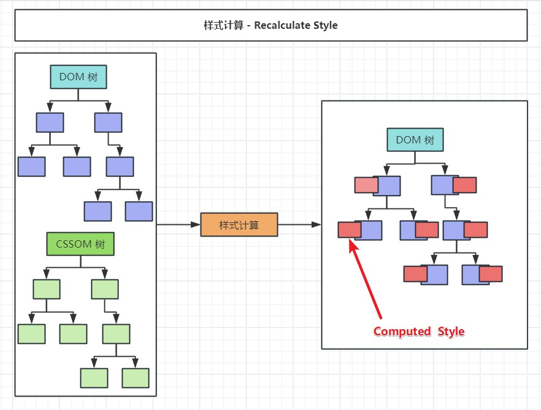

在这一过程中，很多预设值会变成绝对值，比如red会变成rgb(255,0,0)；相对单位会变成绝对单位，比如em会变成px

这一步完成后，会得到一棵带有样式的 DOM 树。

**接下来是布局，布局完成后会得到布局树。**

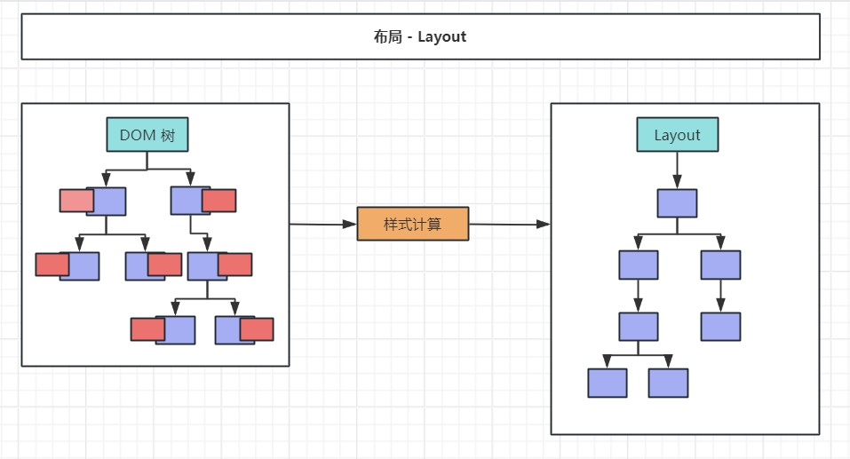

布局阶段会依次遍历 DOM 树的每一个节点，计算每个节点的几何信息。例如节点的宽高、相对包含块的位置。

大部分时候，DOM 树和布局树并非一一对应。

比如display:none的节点没有几何信息，因此不会生成到布局树；又比如使用了伪元素选择器，虽然 DOM 树中不存在这些伪元素节点，但它们拥有几何信息，所以会生成到布局树中。还有匿名行盒、匿名块盒等等都会导致 DOM 树和布局树无法一一对应。

**下一步是分层**

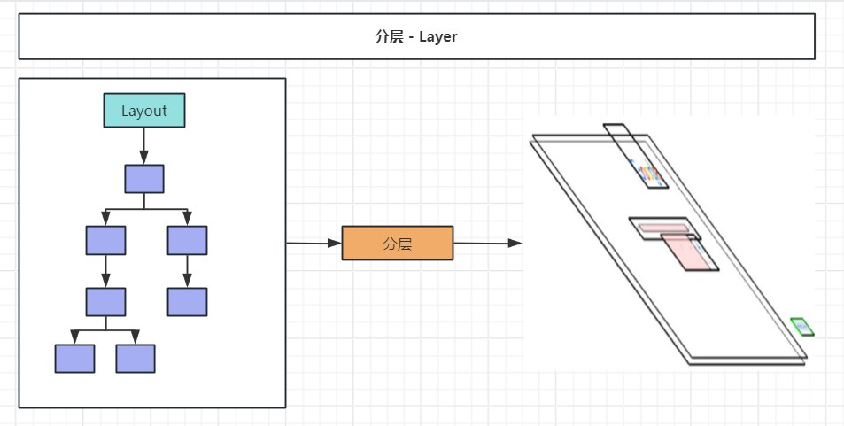

主线程会使用一套复杂的策略对整个布局树中进行分层。

分层的好处在于，将来某一个层改变后，仅会对该层进行后续处理，从而提升效率。

滚动条、堆叠上下文、transform、opacity 等样式都会或多或少的影响分层结果，也可以通过will-change属性更大程度的影响分层结果。

**查看层级**

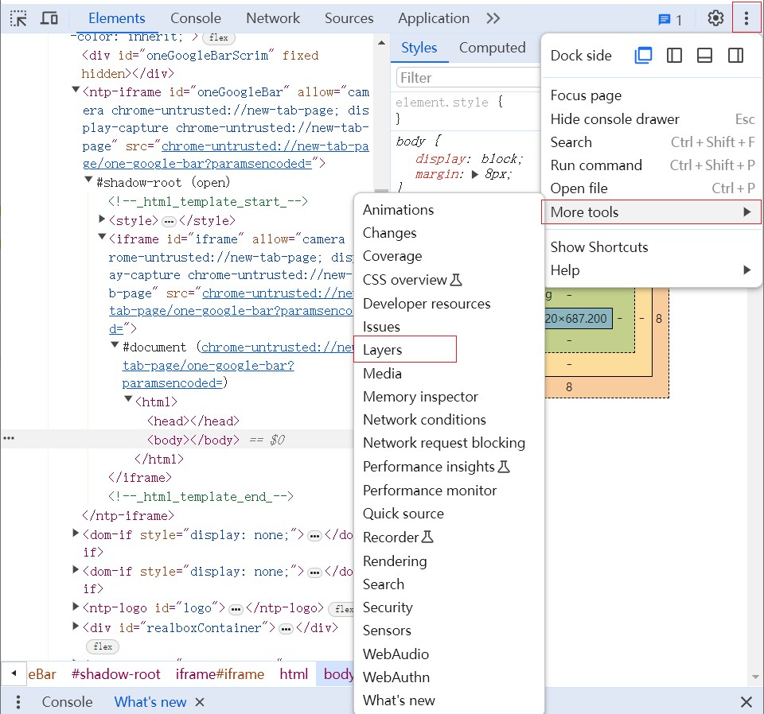

**再下一步是绘制**

主线程会为每个层单独产生绘制指令集，用于描述这一层的内容该如何画出来。

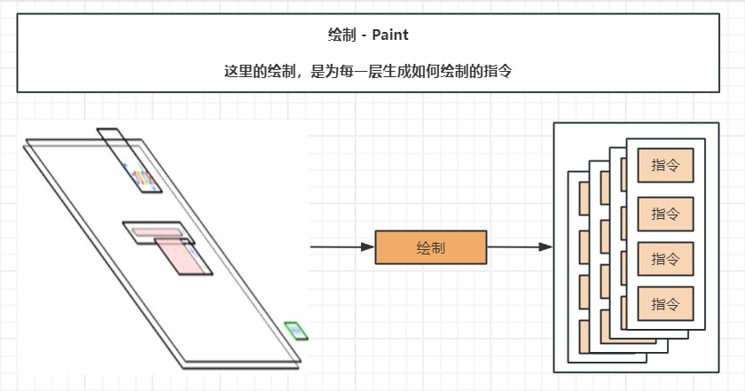

完成绘制后，主线程将每个图层的绘制信息提交给合成线程，剩余工作将由合成线程完成。

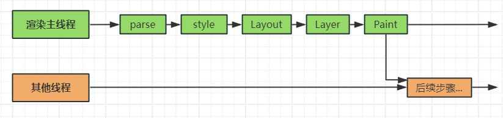

合成线程首先对每个图层进行分块，将其划分为更多的小区域。

它会从线程池中拿取多个线程来完成分块工作。

分块完成后，进入光栅化阶段。

合成线程会将块信息交给 GPU 进程，以极高的速度完成光栅化。

GPU 进程会开启多个线程来完成光栅化，并且优先处理靠近视口区域的块。

光栅化的结果，就是一块一块的位图

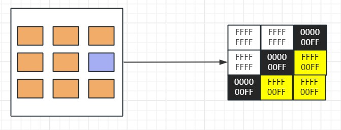

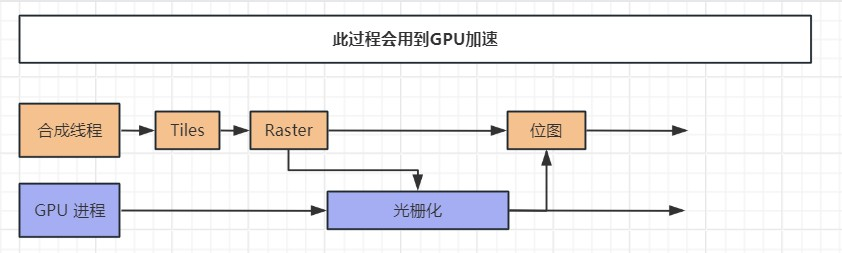

**最后一个阶段就是画了**

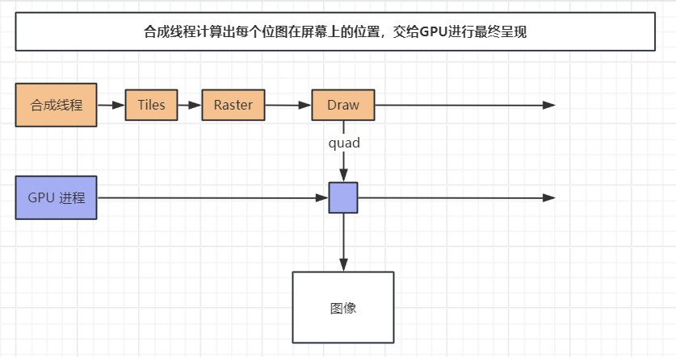合成线程拿到每个层、每个块的位图后，生成一个个「指引（quad）」信息。

指引会标识出每个位图应该画到屏幕的哪个位置，以及会考虑到旋转、缩放等变形。

变形发生在合成线程，与渲染主线程无关，这就是transform效率高的本质原因。

合成线程会把 quad 提交给 GPU 进程，由 GPU 进程产生系统调用，提交给 GPU 硬件，完成最终的屏幕成像。

**完整过程**

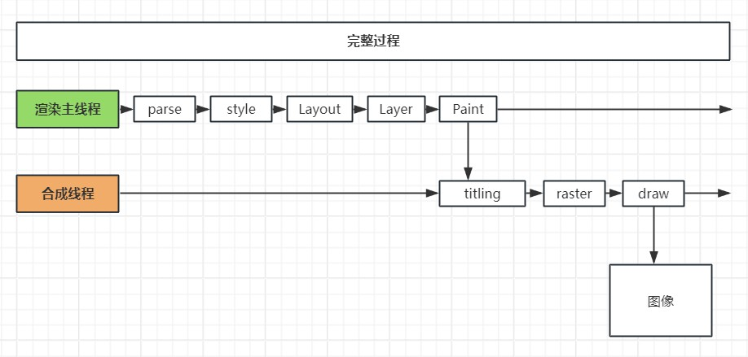

