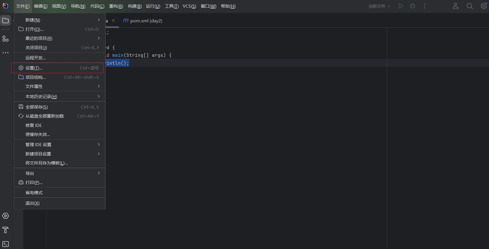
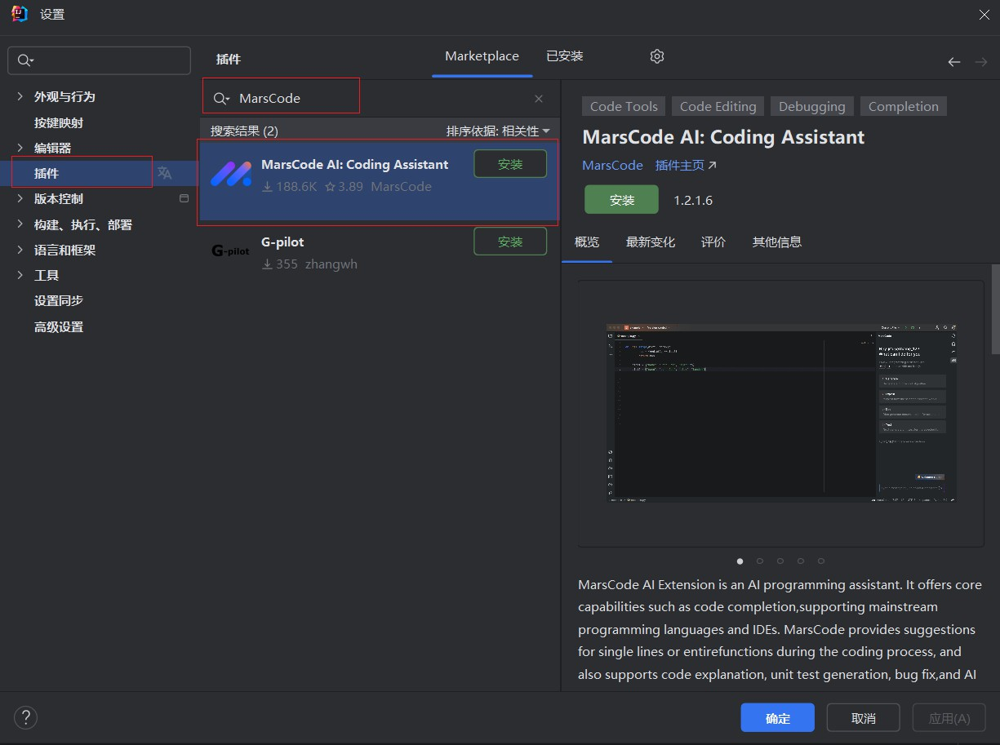
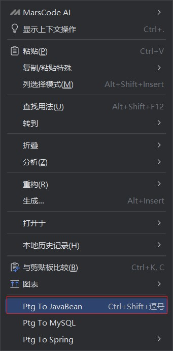

# IDEA插件

## 安装过的插件

```
MarsCode、PTG
```

## 1. 安装插件过程

###   1.1. 文件->设置



###   1.2. 插件->MarsCode->安装



## 2. JAVA的插件

### 	1. MarsCode

#### 		1.1. 介绍

```
1.写注释可以生成代码
2.修改bug
3.解决学习问题
4.自带很多的算法题
```

#### 		1.2. [注册](https://www.marscode.cn/)

### 	2. PTG

#### 		2.1. 介绍

```
快速生成标准的JavaBean类
```

#### 		2.2. 使用

* **1.创建属性**

  ```java
  public class base1  {
  //    属性
      private  int age;
      private String name;
      private String sex;
      private String job;
  }
  ```

* **2.创建标准类**

  * 方法1

  

  * 方法2

```
快捷键  ctrl + shift + ,
```

