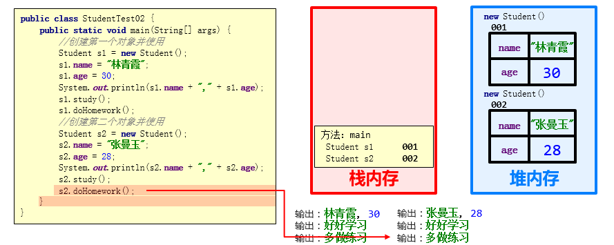
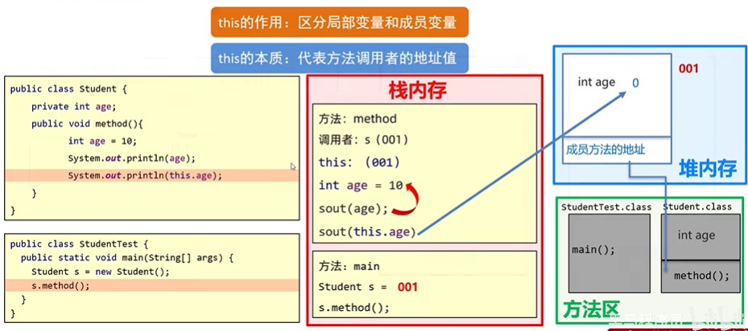

# 内存图讲解

## 	1. java的内存分配

```
堆:方法运行时使用的内存,例如：main方法运行，进入方法栈中执行
栈:存储对象或者数组，new来创建的，都存储在内存
方法区:存储可以运行的class文件
本地方法栈:JVM在使用操作系统功能的时候使用，和我们开发无关
寄存器:给CPU使用，和我们开发无关
```

## 2. 基本数据类型


## 3. 引用数据类型


## 	4. 数组的内存图


## 	5. 两个数组指向同一个空间的内存图


## 6. 方法调用的内存原理

                               

## 7. 二维数组的内存图


## 8. 对象内存图

###   8.1 对象内存的操作步骤

1. 加载class文件
2. 申请局部变量
3. 在堆内存中开辟一个空间
4. 默认初始化
5. 显示初始化
6. 构造方法初始化
7. 将堆内存中的地址赋值给左边的局部变量

###   8.2 单个对象内存图

* 成员变量使用过程


* 成员方法调用过程


###   8.3 多个对象内存图

* 成员变量使用过程


* 成员方法调用过程



* 总结：

  多个对象在堆内存中，都有不同的内存划分，成员变量存储在各自的内存区域中，成员方法多个对象共用的一份

## 9. this的内存图



## 	n. 注意

```
1.从JDK8开始，取消方法区，新增元空间。把原来方法区的多种功能进行拆分，有的功能放到了堆中，有的功能放到了元空间中。
2.只要是new出来的一定是在堆里面开辟了一个小空间
3.如果new了多次。那么在堆里面有多个小空间，每个小空间中都有各自的数据
4.当两个数组指向同一个小空间时,其中一个数组对小空间中的值发生了改变，那么其他数组再次访问的时候都是修改之后的结果了
5.传递引用数据类型时，传递的是地址值，形参的改变，影响实际参数的值
  传递基本数据类型时，传递的是真实的数据，形参的改变，不影响实际参数的值。

```


## 