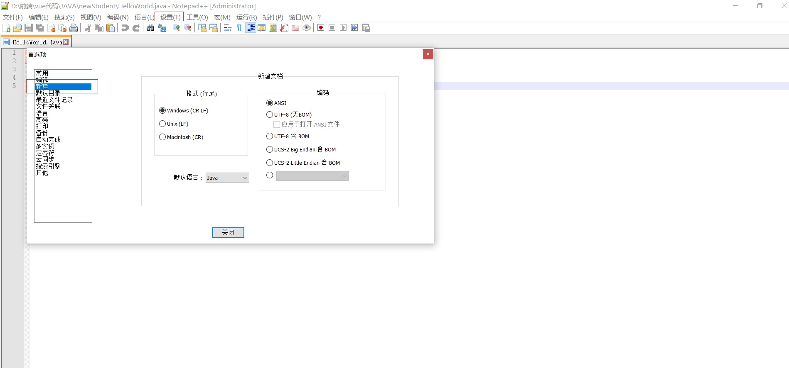

# 基础知识

## 一、cmd使用

### 1.打开cmd

```
a.win+R //打开运行窗口
b.在运行窗口输入cmd
```

### 2.cmd常见命令

常见的CMD命令如下：

| 操作               | 说明                              |
| ------------------ | --------------------------------- |
| 盘符名称:          | 盘符切换。E:回车，表示切换到E盘。 |
| dir                | 查看当前路径下的内容。            |
| cd 目录            | 进入单级目录。cd itheima          |
| cd ..              | 回退到上一级目录。                |
| cd 目录1\目录2\... | 进入多级目录。cd itheima\JavaSE   |
| cd \               | 回退到盘符目录。                  |
| cls                | 清屏。                            |
| exit               | 退出命令提示符窗口。              |

### 3.环境变量

#### 3.1作用：

```
   如果我想要在CMD的任意目录下，都可以启动某一个软件，那么就可以把这个软件的路径配置到环境变量中的PATH里面。
   在启动软件的时候，操作系统会先在当前路径下找，如果在当前录课没有再到环境变量的路径中去找。如果都找不到就提示无法启动。
```

#### 3.2步骤：

```
1.右键我的电脑，选择属性。
2.点击左侧的高级系统设置
3.选择高级，再点击下面的环境变量。
4.找系统变量里面的PATH
5.把软件的完整路径，配置到PATH当中就可以了。
6.（可做可不做）就是把自己配置的路径，移动到最上面。
注意：
移动的好处：在CMD中打开软件时，会先找当前路径，再找环境变量，在环境变量中是从上往下依次查找的，如果路径放在最上面查找的速度比较快。
```

## 二、JAVA基础介绍

### 1.下载jdk

[http://www.oracle.com](http://www.oracle.com/)

### 2.jdk的目录介绍

| 目录名称 | 说明                                                         |
| -------- | ------------------------------------------------------------ |
| bin      | 该路径下存放了JDK的各种工具命令。javac和java就放在这个目录。 |
| conf     | 该路径下存放了JDK的相关配置文件。                            |
| include  | 该路径下存放了一些平台特定的头文件。                         |
| jmods    | 该路径下存放了JDK的各种模块。                                |
| legal    | 该路径下存放了JDK各模块的授权文档。                          |
| lib      | 该路径下存放了JDK工具的一些补充JAR包。                       |

### 3.Java程序开发运行流程

```
1.创建文件HelloWorld.java
2.打开文件、编写、保存
  public class HelloWorld {
	public static void main(String[] args) {
		System.out.println("HelloWorld");
	}
  }
3.编辑文件，自动生成class文件
   javac HelloWorld.java
4.运行代码(class文件不用加文件后缀名)
   java  HelloWorld
```

### 4.配置Path环境变量

```
1.新增配置JAVA_HOME值:D:\develop\jdk
2.再配置Path(%JAVA_HOME%\bin)
```

### 5.Notepad++使用

#### 5.1下载

```
打开百度，搜索一下notepad++就可以了。
```

#### 5.2安装

```
直接点击下一步就可以了。
```

#### 5.3设置

```
  右键点击java文件，选择edit with notepad++。
  点击设置，再点击首选项。在弹出的页面当中，左侧选择新建，中间选择Java，右侧选择ANSI。
```


### 6.Java的三大平台

#### 6.1JavaSE

```
1.介绍
  是其他两个版本的基础。

2.应用
  桌面应用
```

#### 6.2JavaME

```
1.介绍  
  Java语言的小型版，用于嵌入式消费类电子设备或者小型移动设备的开发。
   其中最为主要的还是小型移动设备的开发（手机）。渐渐的没落了，已经被安卓和IOS给替代了。
   但是，安卓也是可以用Java来开发的。
   
2.应用
  移动开发或嵌入式开发
```

#### 6.3 JavaEE

```
1.介绍
  用于Web方向的网站开发。（主要从事后台服务器的开发）
  在服务器领域，Java是当之无愧的龙头老大。

2.应用
  服务器开发
```

### 7.JAVA特点

```
面向对象、安全性、多线程、简单易用、开源、跨平台
```

### 8.JAVA语言跨平台的原理

```
    操作系统本身其实是不认识Java语言的。但是针对于不同的操作系统，Java提供了不同的虚拟机。虚拟机会把Java语言翻译成操作系统能看得懂的语言。
```

### 9.JRE和JDK

#### 1.JDK(Java Development Kit)

```
JDK是Java的开发工具包
  包含: JVM虚拟机:Java程序运行的地方
  	    核心类库:Java已经写好的东西，直接使用
  	    开发工具:Javac、java、jdb、jhat
```

#### 2.JRE(Java Runtime Environment)

```
JRE是Java的运行环境
	包含:JVM
		核心类库
		运行工具 
```

#### 3.JDK、JRE、JVM三者的包含关系

```
JDK包含了JRE
JRE包含了JVM
```

总结：我们只需安装JDK即可，它包含了java的运行环境和虚拟机。