# 基础知识

## 一、cmd使用

### 1.打开cmd

```
a.win+R //打开运行窗口
b.在运行窗口输入cmd
```

### 2.cmd常见命令

常见的CMD命令如下：

| 操作               | 说明                              |
| ------------------ | --------------------------------- |
| 盘符名称:          | 盘符切换。E:回车，表示切换到E盘。 |
| dir                | 查看当前路径下的内容。            |
| cd 目录            | 进入单级目录。cd itheima          |
| cd ..              | 回退到上一级目录。                |
| cd 目录1\目录2\... | 进入多级目录。cd itheima\JavaSE   |
| cd \               | 回退到盘符目录。                  |
| cls                | 清屏。                            |
| exit               | 退出命令提示符窗口。              |

### 3.环境变量

#### 3.1作用：

```
   如果我想要在CMD的任意目录下，都可以启动某一个软件，那么就可以把这个软件的路径配置到环境变量中的PATH里面。
   在启动软件的时候，操作系统会先在当前路径下找，如果在当前录课没有再到环境变量的路径中去找。如果都找不到就提示无法启动。
```

#### 3.2步骤：

```
1.右键我的电脑，选择属性。
2.点击左侧的高级系统设置
3.选择高级，再点击下面的环境变量。
4.找系统变量里面的PATH
5.把软件的完整路径，配置到PATH当中就可以了。
6.（可做可不做）就是把自己配置的路径，移动到最上面。
注意：
移动的好处：在CMD中打开软件时，会先找当前路径，再找环境变量，在环境变量中是从上往下依次查找的，如果路径放在最上面查找的速度比较快。
```

## 二、JAVA基础介绍

### 1.下载jdk

[http://www.oracle.com](http://www.oracle.com/)

### 2.jdk的目录介绍

| 目录名称 | 说明                                                         |
| -------- | ------------------------------------------------------------ |
| bin      | 该路径下存放了JDK的各种工具命令。javac和java就放在这个目录。 |
| conf     | 该路径下存放了JDK的相关配置文件。                            |
| include  | 该路径下存放了一些平台特定的头文件。                         |
| jmods    | 该路径下存放了JDK的各种模块。                                |
| legal    | 该路径下存放了JDK各模块的授权文档。                          |
| lib      | 该路径下存放了JDK工具的一些补充JAR包。                       |

### 3.Java程序开发运行流程

```
1.创建文件HelloWorld.java
2.打开文件、编写、保存
  public class HelloWorld {
	public static void main(String[] args) {
		System.out.println("HelloWorld");
	}
  }
3.编辑文件，自动生成class文件
   javac HelloWorld.java
4.运行代码(class文件不用加文件后缀名)
   java  HelloWorld
```

### 4.配置Path环境变量

```
1.新增配置JAVA_HOME值:D:\develop\jdk
2.再配置Path(%JAVA_HOME%\bin)
```

### 5.Notepad++使用

#### 5.1下载

```
打开百度，搜索一下notepad++就可以了。
```

#### 5.2安装

```
直接点击下一步就可以了。
```

#### 5.3设置

```
  右键点击java文件，选择edit with notepad++。
  点击设置，再点击首选项。在弹出的页面当中，左侧选择新建，中间选择Java，右侧选择ANSI。
```


### 6.Java的三大平台

#### 6.1JavaSE

```
1.介绍
  是其他两个版本的基础。

2.应用
  桌面应用
```

#### 6.2JavaME

```
1.介绍  
  Java语言的小型版，用于嵌入式消费类电子设备或者小型移动设备的开发。
   其中最为主要的还是小型移动设备的开发（手机）。渐渐的没落了，已经被安卓和IOS给替代了。
   但是，安卓也是可以用Java来开发的。
   
2.应用
  移动开发或嵌入式开发
```

#### 6.3 JavaEE

```
1.介绍
  用于Web方向的网站开发。（主要从事后台服务器的开发）
  在服务器领域，Java是当之无愧的龙头老大。

2.应用
  服务器开发
```

### 7.JAVA特点

```
面向对象、安全性、多线程、简单易用、开源、跨平台
```

### 8.JAVA语言跨平台的原理

```
    操作系统本身其实是不认识Java语言的。但是针对于不同的操作系统，Java提供了不同的虚拟机。虚拟机会把Java语言翻译成操作系统能看得懂的语言。
```

### 9.JRE和JDK

#### 1.JDK(Java Development Kit)

```
JDK是Java的开发工具包
  包含: JVM虚拟机:Java程序运行的地方
  	    核心类库:Java已经写好的东西，直接使用
  	    开发工具:Javac、java、jdb、jhat
```

#### 2.JRE(Java Runtime Environment)

```
JRE是Java的运行环境
	包含:JVM
		核心类库
		运行工具 
```

#### 3.JDK、JRE、JVM三者的包含关系

```
JDK包含了JRE
JRE包含了JVM
```

总结：我们只需安装JDK即可，它包含了java的运行环境和虚拟机。

## 三、开发工具IDEA

### 	1.介绍

```
   IDEA全称IntelliJ IDEA，是用于Java语言开发的集成环境，它是业界公认的目前用于Java程序开发最好的工具。
   
   集成环境: 把代码编写，编译，执行，调试等多种功能综合到一起的开发工具。
```

### 	2.下载地址

[官方网站](https://www.jetbrains.com/idea)

### 	3.安装

- 双击安装包。
- 点击next，准备安装


- 点击Browse修改安装路径。

  修改完毕点击next


- 勾选64-bit launcher。表示在桌面新建一个64位的快捷方式。

  其他的不要勾选。

  点击next。


- 点击Install，准备安装。


- 等进度条读取完毕之后，会有最终界面提示。

  点击finish即可。


- 第一次启动会询问，是否导入一些设置。

  选择第二个不导入，保持默认设置，再点击OK。


- 选择背景主题

  左边是黑色背景。右边是白色背景。

  这个可以根据自己的喜好来选择。

  选择完毕点击右下角的next


- 在本界面让我们购买idea。

  因为我们是学习阶段，所以可以使用免费使用30天。

  点击第一排第二个。Evaluate for free


- 点击蓝色的Evaluate，就可以开始免费试用30天了。


- 当看到这个界面，就表示idea已经成功安装完毕

  可以点击右上角关闭。

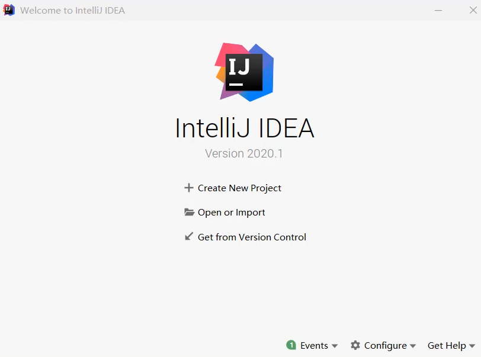

### 4.IDEA中层级结构

#### 	4.1结构分类

- project（项目、工程）

- module（模块）

- package（包）

- class（类）

  #### 4.2层级关系

```
project - module - package - class

project中可以创建多个module
module中可以创建多个package
package中可以创建多个class
```

### 5.使用IDEA

#### 	5.1操作过程

- 创建Project 项目
- 创建Module 模块
- 创建class   类
- 在类中编写代码
- 完成编译运行

#### 	5.2 IDEA中类的相关操作

##### 		5.2.1 新建类文件

- 所有的Java代码都会写在src文件夹当中。

  所以，右键点击src，选择new，点击Java Class

  

- 输入类名，再按回车

  

- 新建完毕


##### 		5.2.2 修改类名

- 右键点击想要修改的文件

  点击Refactor

  再点击Rename


- 输入想要修改的名字

  输入完毕点击下面的Refactor


- 文件名和类名均已修改成功

  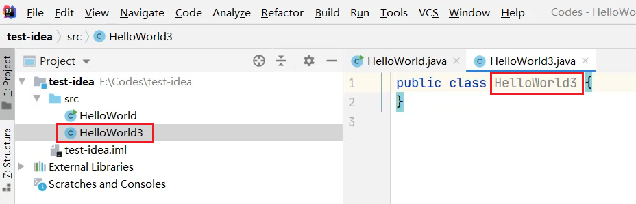

##### 5.2.3 删除类文件

- 想要删除哪个文件，就右键点击该文件

  选择Delete即可


- 在弹出的界面中点击OK，确定删除


> 小贴士：
>
> 此时删除是不走回收站的，直接从硬盘中删掉了。

#### 5.3 IDEA中模块的相关操作

##### 	5.3.1 新建模块

- 点击File，选择Project Structure


- 选择Module


- 点击+

  选择New Module

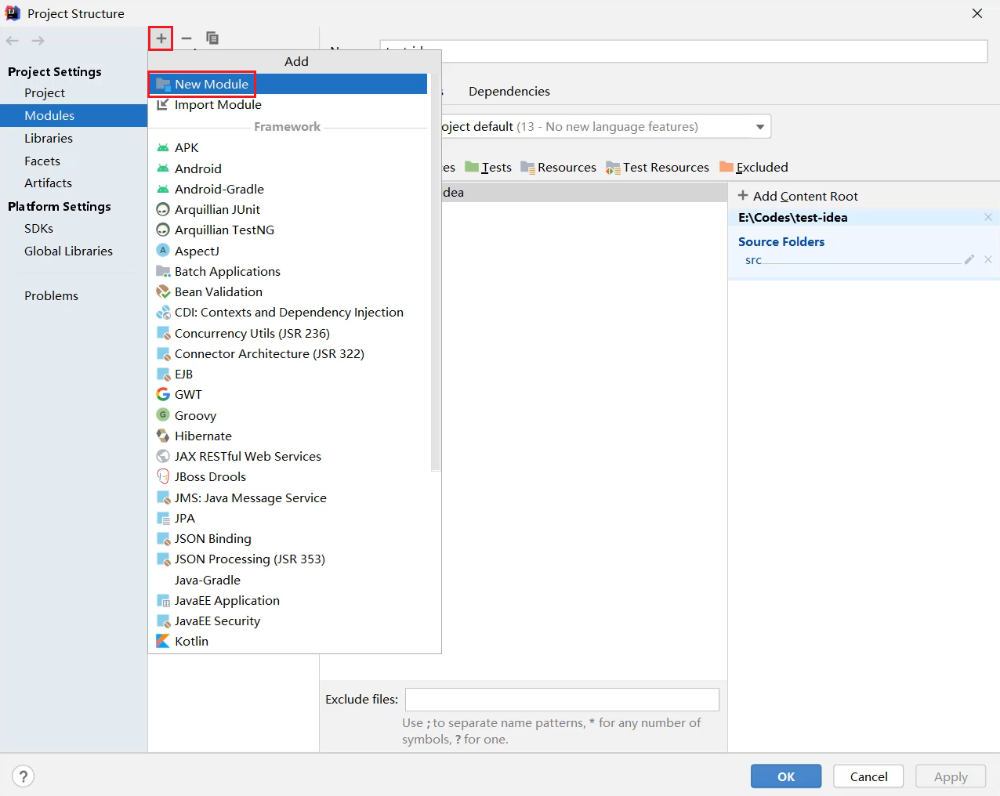

- 要创建一个Java模块，所以选择第一个Java

  点击右下角的Next


- 输入模块的名称

  点击右下角的Finish

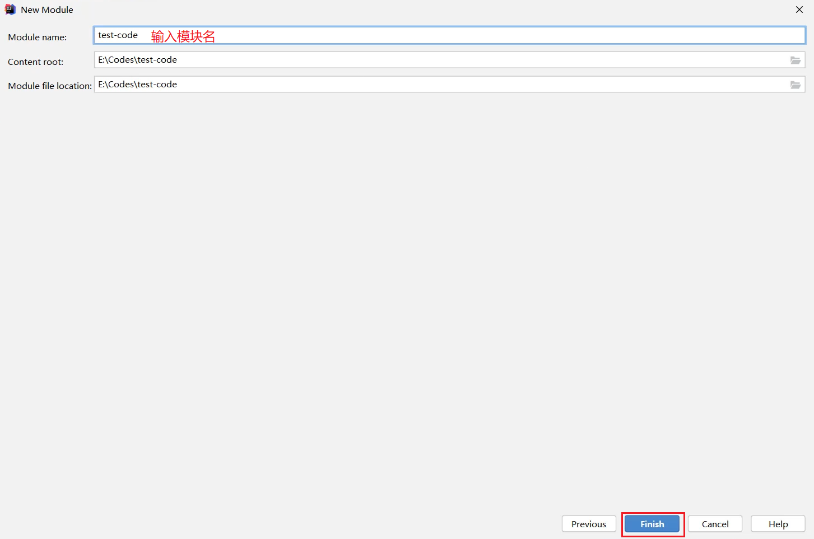

- 成功新建完毕之后，在中间空白区域就出现了刚刚新建的模块

  点击右下角的OK


- 在主界面中，也会出现刚刚新建的模块

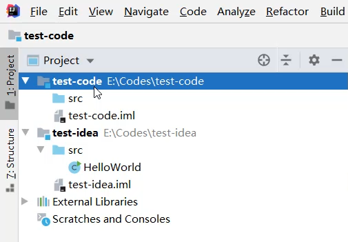

##### 	5.3.2 删除模块

- 右键点击模块

  选择Remove Module


- 选择Remove，表示确定删除


- 此时发现，在IDEA列表页面，删除的模块已经不在了。


> 小贴士：
>
> 此时删除仅仅是从IDEA列表中的删除，在本地硬盘中还是存在的。

##### 	5.3.3 修改模块

- 右键点击模块名

  选择Refactor

  再选择Rename


- 选择第三个修改模块名和本地文件夹名

  点击OK


- 输入要修改的新的模块名

  输入完毕点击Refactor


- 回到主界面，就发现模块名和文件夹名都已经修改完毕

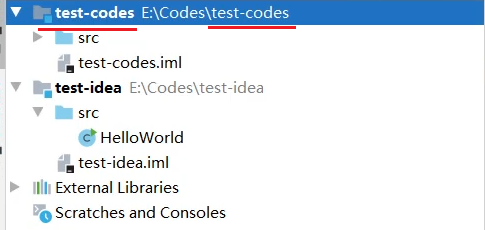


##### 	5.3.4 导入模块

- 点击File，选择Project Structure


- 选择Module

  点击+

  选择Import Module


- 从本地硬盘中选择要导入的模块

  再点击OK


- 不断点击Next


- 如果中间出现提示框，则点击Overwrite

  然后继续点击右下角的Next

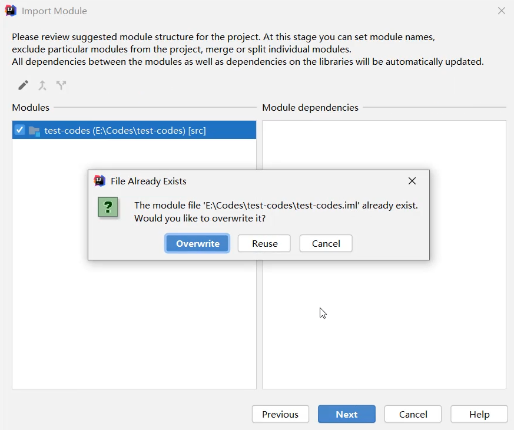

- 一直点到finish为止


- 成功导入后，在中间位置就会出现导入的模块信息


- 在主界面中也会出现导入的模块信息


- 展开模块点击模块中的Java文件，会发现代码报错。

  是因为导入模块跟JDK没有关联导致。

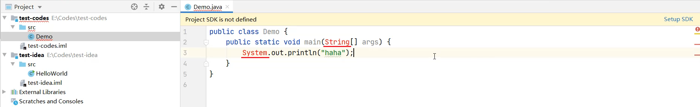


- 可以点击右上角的Setup SDK

  再选择已经安装的JDK版本即可

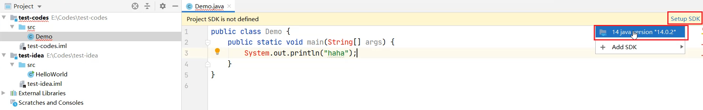

- 导入完毕之后，代码就恢复正常不会报错了


#### 5.4 IDEA中项目的相关操作

##### 	5.4.1 关闭项目

- 点击File，选择Close Project即可


- 刚刚操作的项目就已经关闭了

  左侧是项目列表，如果要再次打开该项目，直接点击即可。

  右侧有create new project，可以再建一个新的项目

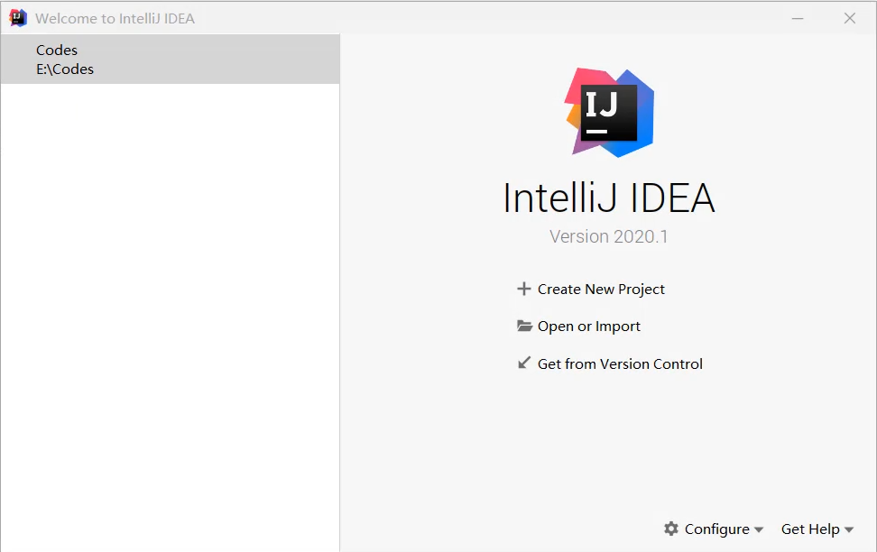

- 鼠标放在项目上，后面会出现一个叉。

  如果点击了这里的叉，会在IDEA的列表中删除。不会删除本地硬盘上的项目。


##### 	5.4.2 打开项目

- 在本界面还可以打开本地已经存在的项目

  点击Open or Import


- 选择要打开的项目

  点击OK


- 项目就被打开了。


##### 	5.4.3 修改项目

- 点击File，选择Project Structure


- 在这个界面，默认是Module

  所以，要先点击Project

  在右侧页面中，输入新的项目名称

  修改JDK版本和编译版本都变成JDK14

  再点击OK


- 此时发现，项目名称已经修改完毕


- 但是本地文件夹的名字还没有修改

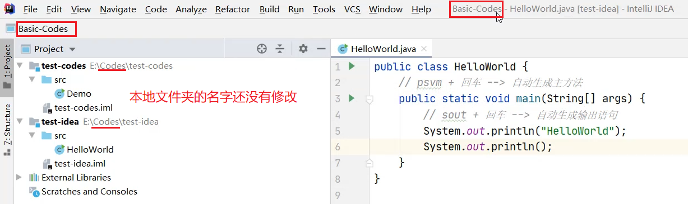

- 需要先关闭当前项目


- 点击项目后面的叉，从列表中移除项目


- 点击Open or Import重新打开项目


- 选择修改之后的项目

  点击OK


- 此时会发现，项目名称和本地硬盘文件夹的名称都已经修改完毕了


##### 	5.4.4 新建项目

- 点击File

  选择New

  点击Project

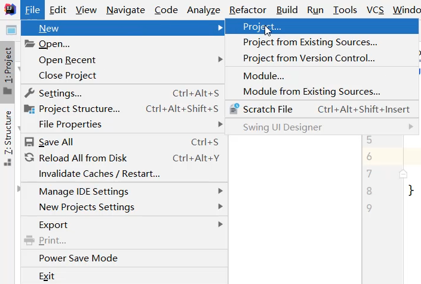

- 同样还是创建一个什么都没有的空项目


- 输入项目的名称

  点击右下角的finish

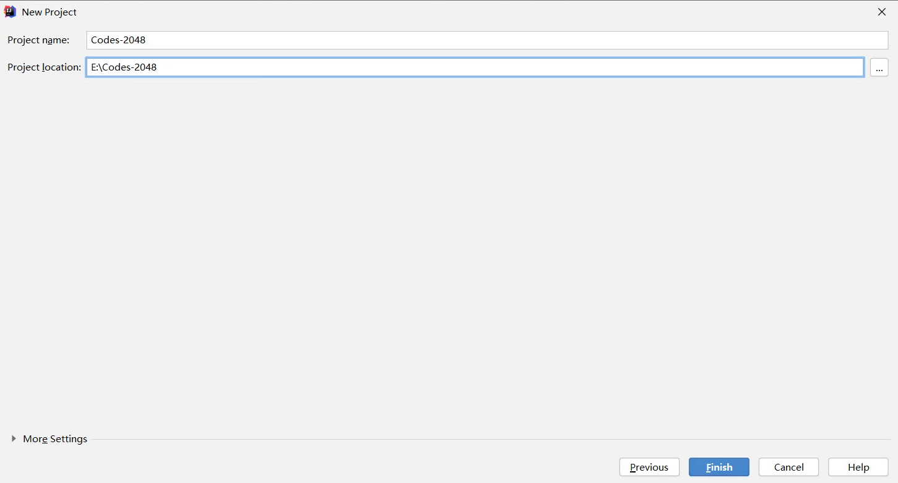

- IDEA循环是否需要帮我们在本地创建一个新的文件夹

  点击OK


- 询问是在本窗口打开还是在一个新的窗口打开。

  可以点击New Window，在一个新的窗口打开。


- 此时就出现了两个窗口，在一个新的窗口打开了新的项目


#### 5.6设置IDEA样式

##### 	5.6.1打开设置


##### 5.6.2设置主体


##### 5.6.3设置字体


5.6.4设置注释颜色


5.6.5设置自动导入包


5.6.6设置编辑器的背景图片


