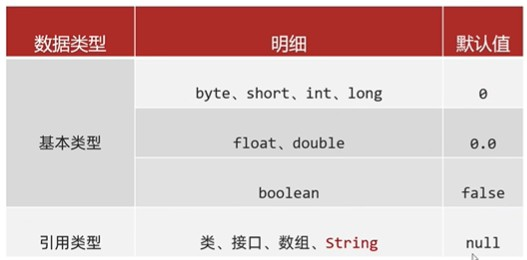
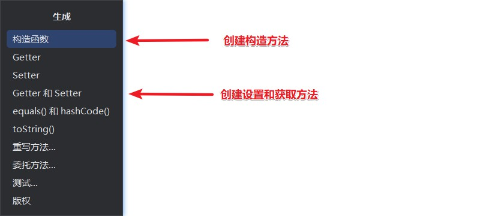
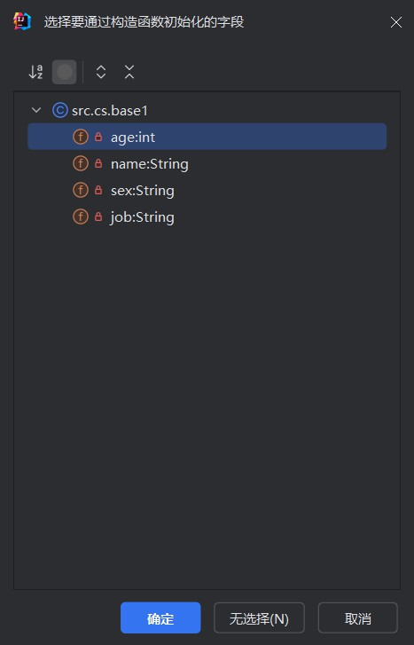
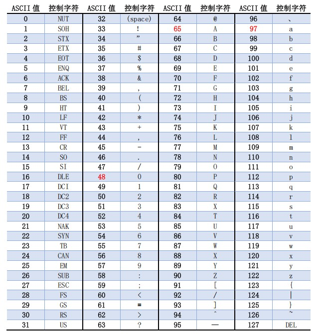

# 基础语法

## 1.注释

```
单行注释  //注释信息
多行注释  /* 注释信息 */
文档注释  /** 注释信息 */
```

## 2.关键字

### 2.1介绍

```
关键字是被Java赋予了特定涵义的英文单词
```

### 2.2特点

```
1.关键字的字母全部小写
2.常见的代码编辑器，针对关键字有特殊的颜色标记，非常直观。
```

### 2.3关键字的介绍

```
class:用于(创建/定义)一个类，类是Java最基本的组成单元。后面跟随类名
```

## 3.字面量

### 3.1.字面量的类型

| **字面量类型** | **说明**                                  | **程序中的写法**           |
| -------------- | ----------------------------------------- | -------------------------- |
| 整数           | 不带小数的数字                            | 666，-88                   |
| 小数           | 带小数的数字                              | 13.14，-5.21               |
| 字符           | 必须使用单引号，有且仅能一个字符          | ‘A’，‘0’，   ‘我’          |
| 字符串         | 必须使用双引号，内容可有可无              | “HelloWorld”，“黑马程序员” |
| 布尔值         | 布尔值，表示真假，只有两个值：true，false | true 、false               |
| 空值           | 一个特殊的值，空值                        | 值是：null                 |

### 3.2区分方法

```
1. 不带小数点的数字都是整数类型的字面量。
2. 只要带了小数点，那么就是小数类型的字面量。
3. 只要用双引号引起来的，不管里面的内容是什么，不管里面有没有内容，都是字符串类型的字面量。
4. 字符类型的字面量必须用单引号引起来，不管内容是什么，但是个数有且只能有一个。
5. 字符类型的字面量只有两个值，true、false。
6. 空类型的字面量只有一个值，null。
```

### 3.3特殊字符

#### 3.3.1  '\t' (制表符)

```java
1.介绍
 在打印时，把前面字符串的长度补齐到8,或者是8的倍数。最少补1个空格，最多补8个空格

2.使用
public class helloWorld {
	public static void main(String[] args) {
		System.out.println("123" + '\t' + "cc");
		System.out.println("12" + '\t' + "dd");
	}
}
打印的结果
123     cc
12      dd


```

#### 3.3.2  ' \r' 

```
1.介绍
将当前位置移到本行开头。又叫回车，对应键盘上的return键
```

#### 3.3.3  '\n'

```
1.介绍
将当前位置移到下一行开头。又叫换行，newline。
```

## 4.变量

### 4.1介绍

```
变量就在程序中临时存储数据的容器。但是这个容器中只能存一个值。
```

### 4.2定义格式

```
数据类型 变量名 = 数据值；
```

### 4.3注意事项

```
1.只能存在一个值
2.变量名不允许重复定义
3.一条语句可以定义多个变量
4.变量在使用之前一定进行赋值
5.变量的作用域范围
```

## 5.数据类型

### 			5.1基本数据类型(四类八种)

| 数据类型 |      关键字      | 内存占用(占用字节) |                 取值范围                  |
| :------: | :--------------: | :----------------: | :---------------------------------------: |
|   整数   |       byte       |         1          |    负的2的7次方 ~ 2的7次方-1(-128~127)    |
|          |      short       |         2          | 负的2的15次方 ~ 2的15次方-1(-32768~32767) |
|          |  **int(默认)**   |         4          |        负的2的31次方 ~ 2的31次方-1        |
|          |       long       |         8          |        负的2的63次方 ~ 2的63次方-1        |
|  浮点数  |      float       |         4          |        1.401298e-45 ~ 3.402823e+38        |
|          | **double(默认)** |         8          |      4.9000000e-324 ~ 1.797693e+308       |
|   字符   |       char       |         2          |                  0-65535                  |
|   布尔   |     boolean      |         1          |                true，false                |

#### 					5.1.1 使用

```
byte    a = -100
short   b = 12
int     c = 123
long    n = 999999999L
float   f = 9.1F
double  d = 20.1
char    e = '中'
boolean h = false
```

#### 					5.1.2 注意

```
1.定义long类型的值时，需要在数据值后面加L作为后缀,L大小写都可以。
2.定义float类型的值时，需要在数据值后面加F作为后缀,F大小写都可以。
```

#### 	  5.1.3 字节

##### 				5.1.3.1 介绍

```
是计算机信息中用于描述存储容量和传输容量的一种计量单位，是计算机的基本存储单位。一个字节由 8个相邻的二进制位（bit） 组成，每个位由0或1组成。字节是计算机技术中最小的可操作存储单位
```

### 			5.2引用数据类型

### 5.3 数据的默认值



## 6.标识符

### 			6.1定义

```
标识符是给类、方法、变量起得名字
```

### 			6.2命名规则

```
1.硬性要求
	a.必须由数字、字母、下划线_、美元符号$组成
	b.数字不能开头
	c.不能是关键字
	d.区分大小写的
2.软性要求
	a.小驼峰命名法:方法、变量(例子:name、firstName)
	b.大驼峰命名法:类名(例子:Student、GoodStudent)
    c.尽量见名之意
```

## 7.运算符

###   7.1.介绍

```
运算符:对字面量或者变量进行操作的符号
表达式:用运算符把字面量或者变量连接起来符合java语法的式子
```

###   7.2.算数运算符

#### 	7.2.1介绍

```
加(+)、减(-)、乘(*)、除(/)、取模或取余(%)
```

#### 	7.2.2使用

```
System.out.println(1+2);    //3
System.out.println(2 - 1 );  //1
System.out.println(10* 2);  //20
System.out.println( 10 / 3);//3
System.out.println(9.0 /3);//3.3333333333333335
System.out.println(10 % 2);//0
System.out.println(10 % 3);//1
```

#### 	7.2.3注意

```
1.整数相除结果只能得到整除，如果结果想要是小数，必须要有小数参数。
2.小数直接参与运算，得到的结果有可能是不精确的。
```

#### 	7.2.4应用场景

```
取余:
	1.可以利用取模来判断一个数是奇数还是偶数
	  System.out.println(15 % 2);//1  奇数
	  System.out.println(16 % 2);//0  偶数
```

#### 	7.2.5 隐式转换(自动类型提升)

##### 		1.介绍

```
把一个取值范围小的数值，转成取值范围大的数据。
```

##### 		2.变量提升的规则

```
a. 取值范围小的，和取值范围大的进行运算，小的会先提升为大的，再进行运算。
b. byte、short、char三种类型的数据在运算的时候，都会直接先提升为int，然后再进行运算。
```

##### 		3.取值范围大小关系

```
double > float > long > int > short > byte
```

#### 				7.2.6前置转换

##### 		1.介绍

```
如果要把一个取值范围大的数据或者变量赋值给另一个取值范围小的变量。是不允许直接操作。如果一定要这么干，就需要加入强制转换。
```

##### 		2.格式

```
	目标数据类型 变量名 = （目标数据类型）被强转的数据；
		int		 b   =    (int)      a;
```

##### 		3.使用

```
byte a = 10;
byte b = 20;
byte c = (byte) (a + b);
System.out.println(c); //30
```

##### 		4.注意

```
强制转换有可能会导致数据发生错误。（数据的精度丢失）
```

#### 	7.2.7字符串的+操作

##### 		1.介绍

```
当+操作中出现字符串时，此时就是字符串的连接符，会将前后的数据进行拼接，并产生一个新的字符串。
当连续进行+操作时，从左到右逐个执行的。
```

##### 		2.使用

```java
System.out.println(123 + "123");//123123

System.out.println(123 + 123 + "123");//246123

System.out.println(123 + "123" + 123);//123123123

System.out.println('中' + "123" + true);//中123true

int age = 18;
System.out.println("我的年龄是：" + age + "岁");//我的年龄是：18岁

System.out.println(1 + 2 + "3" + 4 + 5);//3345
```

#### 	7.2.8字符的 +操作

##### 		1.介绍

```
当（字符+字符）或（字符+数字）时,会把字符通过ASCII码表查询到对应的数字在进行计算
当 (字符+字符串)时,直接进行数据的拼接
```

​		2.使用

```
System.out.println('a' + 'b'); //195
System.out.println('a' + 2); //98
System.out.println('a' + "aa"); //aaa
```

###   7.3自增自减运算符

#### 		7.3.1介绍

```
++ 变量值加1
-- 变量值减1
```

#### 		7.3.2使用

```java
// 直接使用
int num1 = 10;
num1++;
System.out.println(num1);//11
++num1;
System.out.println(num1);//12
num1--;
System.out.println(num1);//11
--num1;
System.out.println(num1);//10

// 计算
int num2 = 10;
//后++ 先赋值 后运算
int x = num2++;
//前++ 先运算 后赋值
int y = ++num2;
System.out.println(x); //10
System.out.println(y);  //12
System.out.println(num2);   //12
```

#### 		7.3.3.注意

```
++和--即可以放在变量的前边,也可以放在后边
```

###   7.4扩展赋值运算符

#### 		7.4.1介绍

| 符号 | 作用       | 说明                   |
| ---- | ---------- | ---------------------- |
| =    | 赋值       | int a = 10,将10赋值给a |
| +=   | 加后赋值   | a+=b,将a+b的值给a      |
| -=   | 减后赋值   | a-=b,将a-b的值给a      |
| *=   | 乘后赋值   | a*=b,将a * b的值给a    |
| /=   | 除后赋值   | a/=b,将a/b的商给a      |
| %=   | 取余后赋值 | a%=b,将a/b的余数给a    |

#### 		7.4.2使用

```java
int a1 = 10;
int b1 = 20;
a1 += b1;
System.out.println(a1); //30
a1 -= b1;
System.out.println(a1); //10
```

#### 		7.4.3注意

```
扩展赋值运算符隐含着强制类型转换
```

###   7.5关系运算符

#### 	7.4.1介绍

| 符号 | 说明                                                 |
| ---- | ---------------------------------------------------- |
| ==   | a==b,判读a和b的值是否相对,成立为true,不成立为false   |
| !=   | a!=b,判读a和b的值是否不相对,成立为true,不成立为false |
| >    | a>b,判读a是否大于b,成立为true,不成立为false          |
| >=   | a>=b,判读a是否大于等于b,成立为true,不成立为false     |
| <    | a<b,判读a是否小于b,成立为true,不成立为false          |
| <=   | a<=b,判读a是否小于等于b,成立为true,不成立为false     |

###   7.6 逻辑运算符

#### 	7.6.1 介绍

| 符号 | 作用     | 说明                   |
| ---- | -------- | ---------------------- |
| &    | 逻辑与   | 两边都为真,结果为真    |
| \|   | 逻辑或   | 两边都为假,结果为假    |
| ^    | 逻辑异或 | 相同为false,不同为true |
| !    | 逻辑非   | 取反                   |

#### 	7.6.2使用

```java
 // &  //两边都是真，结果才是真。
System.out.println(true & true);//true
System.out.println(false & false);//false
System.out.println(true & false);//false
System.out.println(false & true);//false

// | 或  //两边都是假，结果才是假，如果有一个为真，那么结果就是真。
System.out.println(true | true);//true
System.out.println(false | false);//false
System.out.println(true | false);//true
System.out.println(false | true);//true

//^   //左右不相同，结果才是true，左右相同结果就是false
System.out.println(true ^ true);//false
System.out.println(false ^ false);//false
System.out.println(true ^ false);//true
System.out.println(false ^ true);//true

// ! 取反
System.out.println(!false);//true
System.out.println(!true);//false
```

###   7.7 短路运算符

#### 		7.7.1 介绍

| 符号 | 作用   | 说明                         |
| ---- | ------ | ---------------------------- |
| &&   | 短路与 | 结果和&相同，但是有短路效果  |
| \|\| | 短路或 | 结果和\|相同，但是有短路效果 |

#### 		 7.7.2 使用

```
 // &&  //两边都是真，结果才是真。
System.out.println(true && true);//true
System.out.println(false && false);//false
System.out.println(true && false);//false
System.out.println(false && true);//false

// || 或  //两边都是假，结果才是假，如果有一个为真，那么结果就是真。
System.out.println(true || true);//true
System.out.println(false || false);//false
System.out.println(true || false);//true
System.out.println(false || true);//true
```

###   7.8 三元运算符

#### 		7.8.1 介绍

```
关系表达式 ？ 表达式1 ：表达式2 ；

* 如果关系表达式的值为真，那么执行表达式1。
* 如果关系表达式的值为假，那么执行表达式2。
```

#### 		7.8.2 使用

```java
int a = 10;
int b = 20;
int max =  a > b ? a : b ;
System.out.println(max); // 20

System.out.println(a > b ? a : b); // 20
```

###   7.9 运算符优先级

#### 		7.9.1 介绍

| 优先级               | 运算符                            |
| -------------------- | --------------------------------- |
| 1   **初级运算符**   | ()    {}                          |
| 2   **单目运算符**   | !    ~    ++    --                |
| 3   **乘除运算符**   | *    /    %                       |
| 4   **加减运算符**   | +   -                             |
| 5   **位移运算符**   | <<    >>    >>>                   |
| 6   **关系运算符**   | <    <=    >    >=                |
| 7   **相等性运算符** | ==     !=                         |
| 8   **位运算符**     | &    ^   \|                       |
| 9   **逻辑运算符**   | &&  \|\|                          |
| 10   **条件运算符**  | ?:                                |
| 11   **赋值运算符**  | =   +=    -=   *=    /=   %=   &= |
| 12   **逗号运算符**  | ,                                 |

## 8. 原码、反码、补码

###   8.1 介绍

​		1.原码

```
原码
  十进制数据的二进制表现形式，最左边是符号位,0为正,1为负
  
 弊端
   利用原码进行计算的时候,如果是正数完全没有问题。
   但是如果是负数计算，结果就会出错，实际运算的方向，跟正确的运算方向是相反的
```

​		2.反码

```
出现的目的
  为了解决原码不能计算负数的问题而出现的。

计算规则
  正数的反码不变，负数的反码在原码的基础上，符合位不变，数值取反，0变1，1变0

弊端
  负数运算的时候，如果结果不跨0，没有任何问题的，但是如果跨0，跟实际结果会有1的偏差。
```

​		3.补码

```
出现的目的
	为了解决负数计算时跨0的问题

计算规则
	正数的补码不变，负数的补码在反码的基础上+1。
	另外补码还能记录一个特殊的值-128，在数据在1字节下，没有原码和反码。
	
注意点
	计算机中的存储和计算都是以补码的形式进行的。
```

## 9. 流程控制语句

###   9.1 顺序结构

```
顺序结构语句是Java程序默认的执行流程，按照代码的先后顺序从上到下依次执行
```

###   9.2 分支结构

#### 		9.2.1 if语句

##### 1.格式

```
格式1
if (关系表达式) {
    语句体;	
}

格式2：
if (关系表达式) {
    语句体1;	
} else {
    语句体2;	
}

格式3：
if (关系表达式1) {
    语句体1;	
} else if (关系表达式2) {
    语句体2;	
} 
…
else {
    语句体n+1;
}
```

##### 2.注意

```
1.如果我们要对一个布尔类型的变量进行判断，不要写==，直接把变量写在小括号中即可。
2.如果大括号中的语句体只有一条，那么大括号可以省略不写。如果大括号省略了，那么if只能控制距离他最近的那一条语句。

```

##### 3.使用

```java
//获取数据
Scanner sc = new Scanner(System.in);
System.out.println("请输入小明的成绩");
int score = sc.nextInt();
//2.判断
if(score >= 0 && score <= 100){
    //有效的分数
    if(score >= 95 && score <= 100){
        System.out.println("送自行车一辆");
    }else if(score >= 90 && score <= 94){
        System.out.println("游乐场玩一天");
    }else if(score >= 80 && score <= 89){
        System.out.println("变形金刚一个");
    }else{
        System.out.println("胖揍一顿");
    }
}else{
    //无效的分数
    System.out.println("分数不合法");
}
```

#### 9.2.2  switch语句

##### 1.格式

```
switch (表达式) {
	case 1:
		语句体1;
		break;
	case 2:
		语句体2;
		break;
	...
	default:
		语句体n+1;
		break;
}
```

##### 2.使用

````java
//1.键盘录入一个整数表示星期
Scanner sc = new Scanner(System.in);
System.out.println("请输入一个整数表示星期");
int week = sc.nextInt();

//2.书写一个switch语句去跟week进行匹配
switch (week){
	case 1:
		System.out.println("跑步");
        break;
    case 2:
        System.out.println("游泳");
        break;
    case 3:
         System.out.println("慢走");
         break;
    case 4:
         System.out.println("动感单车");
         break;
    case 5:
         System.out.println("拳击");
         break;
    case 6:
         System.out.println("爬山");
         break;
    case 7:
         System.out.println("好好吃一顿");
         break;
    default:
          System.out.println("输入错误，没有这个星期");
          break;
  }
````

##### 3. switch其他知识点

```
1. default的位置和省略
	default可以放在任意位置，也可以省略
2. case穿透
	不写break会引发case穿透现象
3. switch新特性(JDK12以上)
	写法1：
	  int num = 1;
        switch (num) {
            case 1 -> {
                System.out.println("1");
            }
            case 2 ->{
                System.out.println("2");
            }
            default  ->{
                System.out.println("没有");
            }
        }
     写法2：
     	int num = 1;
        switch (num) {
            case 1 -> System.out.println("1");
            case 2 -> System.out.println("2");
            default -> System.out.println("没有");
        }
```

### 9.3 循环结构

####  	9.3.1 for循环

##### 	1.格式

```
for (初始化语句;条件判断语句;条件控制语句) {
	循环体语句;
}
初始化语句：  用于表示循环开启时的起始状态,只执行一次
条件判断语句：用于表示循环反复执行的条件
循环体语句：  用于表示循环反复执行的内容
条件控制语句：用于表示循环执行中每次变化的内容
```

##### 2. 使用

```java
使用1:
for (int i = 1; i <= 5; i++) {
    System.out.println("HelloWorld");
}

使用2:
//需求：定义一个数组，存入1,2,3,4,5。按照要求交换索引对应的元素。
//交换前：1,2,3,4,5
//交换后：5,2,3,4,1
//1.定义数组存储数据
int[] arr = {1,2,3,4,5};
//2.利用循环去交换数据
for(int i = 0,j = arr.length - 1; i < j; i++,j--){
    //交换变量i和变量j指向的元素
    int temp = arr[i];
    arr[i] = arr[j];
    arr[j] = temp;
}
//当循环结束之后，那么数组中的数据就实现了头尾交换
for (int i = 0; i < arr.length; i++) {
    System.out.print(arr[i] + " ");
}
```

####  	9.3.2 while循环

##### 	1.格式

```
初始化语句;
while(条件判断语句){
	循环体;
	条件控制语句;
}
```

##### 2. 使用

```java
int i = 1;
while(i <= 5){
    System.out.println("HelloWorld");
    i++;
}
System.out.println(i);
```

#### 9.3.3 do...while循环

##### 1. 格式：

```java
初始化语句;
do{
    循环体;
    条件控制语句;
}while(条件判断语句);
```

##### 2.特点：

```
先执行，再判断。
```

#### 9.3.4三种格式的区别

```
for和while循环，是先判断，再执行。
do...while是先执行，再判断。
当知道循环次数或者循环范围的时候，用for循环。
当不知道循环次数，也不知道循环范围，但是知道循环的结束条件时，用while循环。
```

### 9.4 无限循环

#### 	9.1 介绍

```
又叫死循环。循环一直停不下来。
```

#### 	9.2 格式

##### 		9.2.1 for格式

```java
for(;;){
    System.out.println("循环执行一直在打印内容");
}

解释：
初始化语句可以空着不写，表示循环之前不定义任何的控制变量。
条件判断语句可以空着不写，如果不写，默认表示true，循环一直进行。
条件控制语句可以空着不写，表示每次循环体执行完毕后，控制变量不做任何变化。
```

##### 		9.2.2 while格式

```java
while(true){
    System.out.println("循环执行一直在打印内容");
}

解释：
  小括号里面就不能省略了，true一定要写出来，否则代码会报错。
```

​		9.2.3 do...while格式

```java
do{
    System.out.println("循环执行一直在打印内容");
}while(true);

解释：
 小括号里面就不能省略了，true一定要写出来，否则代码会报错。
```

#### 	9.3 注意

```
最为常用的格式：while
无限循环下面不能再写其他代码了，因为永远执行不到。
```

#### 	9.4 跳转控制语句

##### 	 9.4.1 continue

###### 		1. 介绍

```
不能单独存在的。只能存在于循环当中。
表示：跳过本次循环，继续执行下次循环。
```

######  		2. 实例

```java
for (int i = 1; i <= 5; i++) {
    if(i == 3){
        //跳过本次循环（本次循环中，下面的代码就不执行了），继续执行下次循环。
        continue;
    }
    System.out.println(i); // 1 2 4 5
}
```

#####  	9.4.1 break

###### 		1. 介绍

```
不能单独存在的。可以用在switch和循环中。
表示结束，跳出的意思。
```

######  		2. 实例

```java
for (int i = 1; i <= 5; i++) {
    System.out.println(i); // 1 2 3
    if(i == 3){
        break;//结束整个循环。
    }
}
```

## 10. 数组

###   10.1 介绍

```
数组指的是一种容器，可以同来存储同种数据类型的多个值。
但是数组容器在存储数据的时候，需要结合隐式转换考虑。

建议:
	容器的类型和存储数据的类型保持一致
```

### 	10.2 数组的定义

#### 			10.2.1 格式

```
格式1.
	数组类型 [] 数组名
	  int  []  array

格式2.
	数组类型  数组名 []
	  int array[]
```

### 	10.3 数组的初始化

#### 			10.3.1 定义

```
初始化:就是在内存中，为数组容器开辟空间，并将数据存入容器中的过程
```

#### 			10.3.2  静态初始化

##### 		10.3.2.1 定义

```
初始化需要指定数组中的元素，系统会根据元素的个数计算出数组的长度
```

##### 		10.3.2.2 格式 + 例子

```java
完整格式:
  类型[] 数组名 = new 数据类型[]{元素1，元素2，元素3，元素4...};
例子:
	int[] array = new int[]{11,22,33}
	double[] array2 = new double[]{11.1,22.2,33.3}

简写格式:
	类型[] 数组名 = {元素1，元素2，元素3，元素4...};
例子:
	int[] array = {11,22,33}
	double[] array2 = {11.1,22.2,33.3}
```

#### 	10.3.3 动态初始化

##### 		10.3.3.1 定义

```
初始化时只指定数组的长度,由系统为数组分配初始值
```

##### 		10.3.3.2 格式

```
数据类型[] 数据名 = new 数据类型[数组长度]
```

##### 		10.3.3.3 例子

```
int[] arr = new int[3]
```

##### 		10.3.3.4 初始化值的规律

```
整数类型: 	0
小数类型: 	0.0
字符类型: 	'/u0000'  空格
布尔类型: 	 false
引用数据类型: null
```


### 	10.4 地址值

```java
int[] arr = {1,2,3,4,5};
System.out.println(arr);//[I@6d03e736

double[] arr2 = {1.1,2.2,3.3};
System.out.println(arr2);//[D@568db2f2

打印数组的时候，实际出现的是数组的地址值。
数组的地址值：就表示数组在内存中的位置。
    
以[I@6d03e736为例：
  [ ：表示现在打印的是一个数组。
  I：表示现在打印的数组是int类型的。
  @：仅仅是一个间隔符号而已。
  6d03e736：就是数组在内存中真正的地址值。（十六进制的）

但是，我们习惯性会把[I@6d03e736这个整体称之为数组的地址值。
```

### 	10.5 数组元素访问

#### 		10.5.1 格式

```
数组名[索引]
```

#### 		10.5.2 索引介绍

```
索引就是下标，角标
索引的特点: 从0开始,逐个+1增长,连续不间断
```

### 	10.6 数据存储到数组中

#### 		10.6.1 格式

```
格式:
	数组名[索引] = 具体数据/变量
	
细节:
	一但覆盖之后，原来的数据就不存在了
```

#### 		10.6.2 例子

```java
int[] a3 = {11,12,13,14,15};
System.out.println(a3[0]); // 11
a3[0] = 100;
System.out.println(a3[0]); // 100
```

### 	10.7 数组的遍历

#### 		10.7.1 介绍

```
将数组中的所有的内容取出来。取出来做其他操作
```

#### 		10.7.2 操作

```
String [] name2 = {"张三","李四","王五","赵六"};
for (int i = 0; i < name2.length; i++) {
	System.out.println(name2[i]);
}
```

### 10.8 数组常见问题

#### 	10.8.1 索引越界问题

```
当访问了数组中不存在的索引时,就会引发索引越界异常

例子:
  int[] a = {11,12,13,14,15};
  System.out.println(a[5]);

报错原因:
访问了不存在的索引

报错提示：
Exception in thread "main" java.lang.ArrayIndexOutOfBoundsException: Index 5 out of bounds for length 5
at src.com.test.shuzuchangjianwenti.main(shuzuchangjianwenti.java:9)
```

### 10.9 二维数组

#### 10.9.1 二维数组介绍

```
数组中存数组
```

#### 10.9.2 使用场景

```
数据需要分组整理的时候，需要用到二维数组
```

#### 10.9.3 二维数组的静态初始化

```java
格式:
  数据类型[][] 数组名= new 数据类型[][]{{元素1，元素2},{元素1，元素2}}
例子:
  int[][] arr = new int[][]{{1,2},{3,4}}
  
简单格式:
    数据类型[][] 数组名= {{元素1，元素2},{元素1，元素2}}   
例子:
  int[][] arr = {{1,2},{3,4}}
```

#### 10.9.4 二维数组的动态初始化

```java
格式：
  数据类型[][] 数组名= new 数据类型[m][n];
    m: 表示这个二维数组可以存放多少个一维数组
    n: 表示一维数组中能存放多少个元素
   
  例子1:
  	int[][] arr = new int[2][5]
  
  例子2:
  	int[][] arr1 = new int[2][]
    int[] arr2 = {1,2,3}
	int[] arr3 = {4,5}
	arr1[0] = arr2
    arr1[1] = arr3   
```


#### 10.9.5 获取二维数组数据

```
数组名[i][j]
i:二维数组的索引，获取出来的是里面的一维数组
j:表示一维数组中的索引，获取出来的是真实的数据
```

#### 10.9.6 二维数组的遍历

```java
int[][] arr =  {{1,2},{3,4}}
for(int i = 0; i< arr.length; i++){
	for(int j = 0; j< arr[i].length; j++){
		System.out.print(arr[i][j]+ " ");
	}
	System.out.println();
}
```

## 11.方法

### 	11.1 介绍

```
介绍:
   方法是程序中最小的执行单位。
   重复的代码、具有独立功能的代码可以抽取到方法中。

方法的好处:
	提高代码的重复性
	提高代码的可维护性

注意:
	方法必须先创建才可以使用，该过程成为方法定义
	方法创建后并不是直接可以运行的，需要手动使用后，才执行，该过程成为方法调用
```

### 	11.2 最简单的方法格式

#### 		11.2.1 定义

```
定义:
public static void 方法名 (   ) {    
	 // 方法体;
 }
 
调用:
  方法名();
```

#### 		11.2.2 使用

```java
public class MethodTest {
    public static void main(String[] args) {
        //在main()方法中调用定义好的方法
        getMax();
    }

    //定义一个方法，用于打印两个数字中的较大数，例如getMax()
    public static void getMax() {
        //方法中定义两个变量，用于保存两个数字
        int a = 10;
        int b = 20;

        //使用分支语句分两种情况对两个数字的大小关系进行处理
        if(a > b) {
            System.out.println(a);
        } else {
            System.out.println(b);
        }
    }
}
```

### 11.3 带参数的方法格式

#### 	11.3.1 介绍

```
形参: 全称形式参数,是指方法定义中的参数
实参: 全称实际参数,方法调用中的参数
```

#### 	11.3.2 定义

```
定义:
public static void 方法名 (参数1) {
	方法体;
}

public static void 方法名2 (参数1, 参数2) {
	方法体;
}

使用：
方法名(参数);
方法名2(参数1,参数2);
```

#### 	11.3.3 使用

```
定义:
public static void isEvenNumber(int number){
    ...
}
public static void getMax(int num1, int num2){
    ...
}

使用:
isEvenNumber(10);
getMax(10,20);
```

#### 	11.3.4 注意

```
方法定义时，参数中的数据类型与变量名都不能缺少，缺少任意一个程序将报错
方法定义时，多个参数之间使用逗号( ，)分隔
方法调用时，参数的数量与类型必须与方法定义中的设置相匹配，否则程序将报错 
```

### 11.4 带返回值方法

#### 	11.4.1 定义

```
定义:
  public static 数据类型 方法名 ( 参数 ) { 
	return 数据 ;
  }
  
调用:
  方法名 ( 参数 ) ;
  数据类型 变量名 = 方法名 ( 参数 ) ;
```

#### 	11.4.2 使用

```
public static boolean isEvenNumber( int number ) {               
   return true ;
 }
 public static int getMax( int a, int b ) {    
    return  a + b ;
 }
 
boolean  flag =  isEvenNumber ( 5 ); 
int num = getMax(10, 20);
```

### 11.5 方法的注意事项

```
1.方法不调用就不执行
2.方法与方法之间是平级关系，不能相互嵌套
3.方法的编写顺序和执行顺序无关
4.方法的返回值类型为void，表示该方法没有返回值
   没有返回值的方法可以省略return语句不写
   如果要编写return，后面不能跟具体的数据
5.return语句下面，不能编写代码。因为永远执行不到，属于无效的代码
```

### 11.6 方法的重载

#### 	11.6.1 介绍

```
在同一个类中，定义了多个同名的方法，这些同名的方法具有同种的功能。
每个方法具有不同的参数类型或参数个数，这些同名的方法，就构成了重载关系。

简单记: 同一个类中，方法名相同，参数不同的方法，与返回值无关。
参数不同包括: 个数不同、类型不同、顺序不同

```

#### 	11.6.2 例子

```java
//需求：使用方法重载的思想，设计比较两个整数是否相同的方法，兼容全整数类型（byte,short,int,long） 

public class MethodTest {
    public static void main(String[] args) {
        //调用方法 根据参数的不同触发不同的方法
        System.out.println(compare(10, 20));
        System.out.println(compare((byte) 10, (byte) 20));
        System.out.println(compare((short) 10, (short) 20));
        System.out.println(compare(10L, 20L));
    }

    //int
    public static boolean compare(int a, int b) {
        System.out.println("int");
        return a == b;
    }

    //byte
    public static boolean compare(byte a, byte b) {
        System.out.println("byte");
        return a == b;
    }

    //short
    public static boolean compare(short a, short b) {
        System.out.println("short");
        return a == b;
    }

    //long
    public static boolean compare(long a, long b) {
        System.out.println("long");
        return a == b;
    }

}
```

## 12. 面向对象

###   12.1 类

####     12.1.1 介绍

```
类是对象共同特征的描述
```

####     12.1.2 定义类

```java
public class 类名 {
	成员变量(属性);
	成员方法(行为);
	构造器;
	代码块;
	内部类;
}
```

####     12.1.3 定义类的补充注意事项

```
1.用来描述一类事物的类,专业叫做: JavaBean类
  在javaBean类中,是不写main方法的
  
2.编写main方法的类叫做测试类。
  可以在测试类中创建javabean类的对象并进行赋值调用
  
3.一个java文件中可以定义多个class类，且只能一个类是public修饰，而且public修饰的类名必须成为代码文件名

4.成员变量的完整定义格式是:
	修饰符 数据类型 变量名称 = 初始化值;
  一般无需指定初始化值,存在默认值。
```


###   12.2 对象

####     12.2.1 定义

```
对象是真实存在的具体东西
```

#### 	12.2.2 对象的使用

```java
创建对象的格式：
	类名 对象名 = new 类名();
调用成员的格式：
	对象名.成员变量
	对象名.成员方法();
```

### 	12.3 类和对象的例子

```java
//文件Phone.java
public class Phone {
    //成员变量
    String brand;
    int price;

    //成员方法
    public void call() {
        System.out.println("打电话");
    }

    public void sendMessage() {
        System.out.println("发短信");
    }
}

//文件 PhoneDemo.java
public class PhoneDemo {
    public static void main(String[] args) {
        //创建对象
        Phone p = new Phone();

        //使用成员变量
        System.out.println(p.brand);
        System.out.println(p.price);

        p.brand = "小米";
        p.price = 2999;

        System.out.println(p.brand);
        System.out.println(p.price);

        //使用成员方法
        p.call();
        p.sendMessage();
    }
}
```

###   12.4 面向对象的三大特征

```
封装、继承、多态
```

###    12.5 封装

#### 		12.5.1 封装的好处

* 对象代表什么就得封装对应的数据，并提供数据对应的行为
* 降低我们的学习成本，可以少学，少记，或者说压根不用学，不用记对象有哪些方法，有需要时去找就行


#### 	12.5.2封装代码实现

​          将类的某些信息隐藏在类内部，不允许外部程序直接访问，而是通过该类提供的方法来实现对隐藏信息的操作和访问
  成员变量private，提供对应的getXxx()/setXxx()方法。


###     12.6 继承

###     12.7 多态

## 13.关键字

###     13.1 private

#### 		13.1.1 介绍

* 是一个权限修饰符
* 可以修饰成员(成员变量和成员方法)
* 被private修改的成员只能在本类中访问,针对private修饰的成员变量，如果需要被其他类使用，提供相应的操作
  * 提供“get变量名()”方法，用于获取成员变量的值，方法用public修饰
  * 提供“set变量名(参数)”方法，用于设置成员变量的值，方法用public修饰

####   13.2.2 使用

```java
/*
    学生类
 */
class Student {
    //成员变量
    String name;
    private int age;

    //提供get/set方法
    public void setAge(int a) {
        if(a<0 || a>120) {
            System.out.println("你给的年龄有误");
        } else {
            age = a;
        }
    }

    public int getAge() {
        return age;
    }

    //成员方法
    public void show() {
        System.out.println(name + "," + age);
    }
}
/*
    学生测试类
 */
public class StudentDemo {
    public static void main(String[] args) {
        //创建对象
        Student s = new Student();
        //给成员变量赋值
        s.name = "林青霞";
        s.setAge(30);
        //调用show方法
        s.show();
    }
}
```

###   13.2 this

#### 		13.2.1 介绍

* this修饰的变量用于指代成员变量，其主要作用是（区分局部变量和成员变量的重名问题）
  * 方法的形参如果与成员变量同名，不带this修饰的变量指的是形参，而不是成员变量
  * 方法的形参没有与成员变量同名，不带this修饰的变量指的是成员变量

#### 	13.2.2 使用

```java
public class Student {
    private String name;
    private int age;

    public void setName(String name) {
        this.name = name;
    }

    public String getName() {
        return name;
    }

    public void setAge(int age) {
        this.age = age;
    }

    public int getAge() {
        return age;
    }

    public void show() {
        System.out.println(name + "," + age);
    }
}
```

#### 	13.2.3. 成员变量和局部变量

#####         13.2.3.1 成员变量和局部变量的区别

* 类中位置不同：成员变量（类中方法外）局部变量（方法内部或方法声明上）
* 内存中位置不同：成员变量（堆内存）局部变量（栈内存）
* 生命周期不同：成员变量（随着对象的存在而存在，随着对象的消失而消失）局部变量（随着方法的调用而存在，醉着方法的调用完毕而消失）
* 初始化值不同：成员变量（有默认初始化值）局部变量（没有默认初始化值，必须先定义，赋值才能使用

##### 	      13.2.3.2 使用

```java
private  int age = 11;

public void setAge(){
   int age = 12;
   System.out.println(age);  //局部变量   12
   System.out.println(this.age);   //成员变量   11
  }
```

## 14. 构造方法

### 	14.1 概述

* 构造方法也叫作构造器、构造函数

* **作用：**在构建对象的时候给成员变量进行初始化的。

* **格式：**

```
public class 类名{
// 存在参数的为有参构造
	修饰符 类名( 参数 ) {

      }
// 不存在参数为无参构造
	修饰符 类名() {

      }
}
```

* **特点：**

  * 1.方法名与类名相同，大小写也一致
  * 2.没有返回值类型，连void都没有
  * 3.没有具体的返回值(不能由return带回结果数据)

* **执行时机：**

  * 1.创建对象的时候由虚拟机调用，不能手动调用构造方法
  * 2.每创建一次对象，就会调用一次构造方法


### 14.2 构造方法的注意事项

* 构造方法的创建

如果没有定义构造方法，系统将给出一个默认的无参数构造方法
如果定义了构造方法，系统将不再提供默认的构造方法

* 构造方法的重载

如果自定义了带参构造方法，还要使用无参数构造方法，就必须再写一个无参数构造方法

* 推荐的使用方式

无论是否使用，都手工书写无参数构造方法和带全部参数的构造方法

### 14.3 例子

```java
/*
    学生类
 */
class Student {
    private String name;
    private int age;

    public Student() {}

    public Student(String name) {
        this.name = name;
    }

    public Student(int age) {
        this.age = age;
    }

    public Student(String name,int age) {
        this.name = name;
        this.age = age;
    }

    public void show() {
        System.out.println(name + "," + age);
    }
}
/*
    测试类
 */
public class StudentDemo {
    public static void main(String[] args) {
        //创建对象
        Student s1 = new Student();
        s1.show();

        //public Student(String name)
        Student s2 = new Student("李四");
        s2.show();

        //public Student(int age)
        Student s3 = new Student(30);
        s3.show();

        //public Student(String name,int age)
        Student s4 = new Student("张三",30);
        s4.show();
    }
}
```

### 14.4 标准的JavaBean类

① 类名需要见名知意

② 成员变量使用private修饰

③ 提供至少两个构造方法 

* 无参构造方法
* 带全部参数的构造方法

④ get和set方法 

​	提供每一个成员变量对应的setXxx()/getXxx()

⑤ 如果还有其他行为，也需要写上

## 15 链式编程

### 	15.1 介绍

  当在调用方法的时候，不需要用变量接收的结构可以继续调用其他方法

### 	15.2 例子

```java
StringBuilder sb = new StringBuilder();     sb.append("123").append("234").append("345").append("456");
System.out.println(sb); // 123234345456
```

## 16. 关于字符串的小扩展：

1. **字符串存储的内存原理**

* 直接赋值

  * 特点：

  ​	  String s = “abc”；

  ​      此时字符串abc是存在字符串常量池中的。

  ​	  先检查字符串常量池中有没有字符串abc，如果有，不会创建新的，而是直接复用。如果没有abc，才会创建一个新的。

  ​       所以，直接赋值的方式，代码简单，而且节约内存。

* new出来的字符串

  *  看到new关键字，一定是在堆里面开辟了一个小空间。
  *  例子：String s1 = new String（“abc”）；

2. **==号比较的到底是什么？**

* 如果比较的是基本数据类型：比的是具体的数值是否相等。

* 如果比较的是引用数据类型：比的是地址值是否相等。

* 结论：==只能用于比较基本数据类型。不能比较引用数据类型。


	3. **字符串拼接的底层原理**

* 如果没有变量参加，都是字符串直接相加，编译之后就是拼接之后的结构,会复用串池中的字符串。
* 如果有变量参与，每一行拼接的代码，都会在内存中创建新的字符串，浪费内存。

4. **StringBuilder提高效率原理图**

* 所有要拼接的内存都会往StringBuilder中放，不会创建很多无用的空间，节约内存。

5. **StringBuilder源码分析**

* 默认创建一个长度为16的字节数组
* 添加的内容长度小于16，直接存
* 添加的内容大于16会扩容(原来的容量*2+2)
* 如果扩容之后还不够，以实际长度为准

## 17 集合

### 	17.1 介绍 

* java集合可分为Set、List、Queue和Map四种体系。

  * set代表无序、不可重复的集合

  * List代表有序、重复的集合

  * Map则代表具有映射关系的集合

  * Queue代表一种队列集合实现

* Java集合就像是一种容器，可以把多个对象（实际上是对象的引用，但习惯上都称对象）“丢进”该容器中。从Java5 增加了泛型以后，Java集合可以记住容器中对象的数据类型，使得编码更加简洁、健壮。

### 	17.2 集合和数组区别

* 长度区别：数组的长度固定，而集合长度可变

* 内容区别：数组可以是基本数据类型，也可以是引用数据类型（类、接口、数组）；二集合只能是引用数据类型

* 元素内容：数组只能存储同一数据类型，集合可以存储不同数据类型（集合一般存储的也是同一数据类型）

  

  

### 17.3  ArrayList

#### 1 特定

* ArrayList是集合的一个实现类；

* ArrayList内部封装了一个Object类型的对象，初始长度为0，且长度可变

* ArrayList集合的查询快，但是增删慢

* 线程不安全

## 18 泛型

### 1 介绍

* 泛型： 限定集合中存在数据的类型

### 2 泛型使用

```java
ArrayList<String> list = new ArrayList<>();
```

### 3 泛型类型

* String 字符串
* Integer 数值
* Character 字符

## n.java 代码

```
//输出语句
System.out.println(); //换行输出
System.out.print(a[i] +" ");  // 数据一行展示
//参数1中的%s表示站位  参数2:表示填充的数据
System.out.printf("你好呀%s","张三")
System.out.printf("%s是%s的爸爸","张三","张四")

// 字符串方法
String s = "sdasdsdasdasd";
s.length()       // 获取字符串长度
s.toUpperCase()  // 将字符串全部转成大写
```


## n.idea的代码快捷

```
psvm   :   public static void main(String[] args) {}   // 程序的主入口

sout   :   System.out.println(); //输出语句

变量.fori   //for循环

```

## n.idea的快捷键

```
shift + alt + F  //自动格式化代码
选中方法 + ctrl + alt +V //自动生成左侧的变量
选中方法的() + ctrl + p // 提示对应的参数
选中抽取的代码 + ctrl + alt + M  // 自动抽取代码
选中变量 + shift + F6 // 批量修改变量
选中内容 + ctrl + alt + t //选中使用什么方法包裹(如if)

```

### 	n.1 快速创建标准类

* **1.创建属性**

```java
public class base1  {
//    属性
    private  int age;
    private String name;
    private String sex;
    private String job;
}
```

* **2.快捷键 atl + insert**



* **3.构造方法**



```
1.选中无选项创建无参数的构造方法
2.ctrl+a 选择所有的参数,点击确定创建构造方法
3.ctrl + 鼠标左键选中参数,点击确定创建构造方法
```

* **4.创建get和set方法**


```
1.ctrl+a 选择所有的参数,点击确定创建get和set方法
2.ctrl + 鼠标左键选中参数,点击确定创建get和set方法
```


## n.计算机的存储规则

```
1.存储的数据类型
text文本:数字(转为二进制)、字母(对应码表转成二进制)、汉字(对应码表转成二进制)
image图片:黑白图、灰度图、彩色图
Sound声音:波长数据

2.存储的数据格式
任意的数据都是以二进制的形式存储的

3.计算机的三原色
 a.计算机中的颜色采用光学三原色
 b.分别为:红、绿、蓝。称为RGB
 c.写法:(255,255,255)或(FFFFFF)
```

## n.ASCII码

