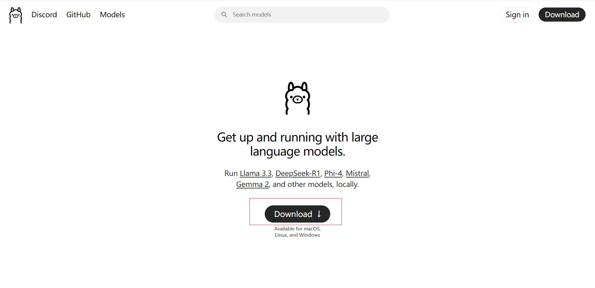
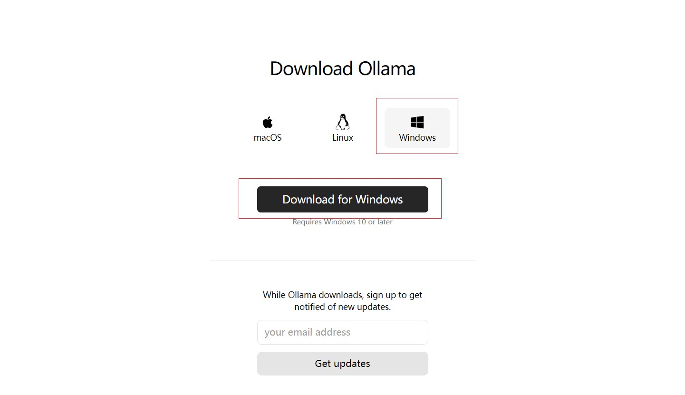

# Deepseek学习

## 1.Deepseek平台应用

### 1.1 了解Deepseek-V3

```
* Deepseek-V3模型在性能上全面对标海外领军闭源模型，生成速度也大幅提升，成为当前最强大的开源基础模型之一。

* Deepseek-V3是一款拥有671B参数的大型混合专家(MoE)模型，其中每个token会有37B参数被激活。
```

### 1.2 了解DeepSeek-R1

```
* DeepSeek-R1在性能上全面对齐OpenAI o1正式版，并开放了思维链输出功能。
* DeepSeek还宣布将模型开源license统一变更为MIT许可证，并明确用户协议允许“模型蒸馏”，进一步拥抱开源，促进技术共享
```

### 1.3 应用

```
代码改写
代码解释
代码生成
内容分类
结构化输出
角色扮演(自定义人设)
角色扮演(情节续写)
散文写作
诗歌创作
文案大纲生成
宣传标语生成
模型提示词生成
中英文翻译专家
```

## 2.DeepSeek的本地部署

### 2.1 [访问Ollama官网](https://ollama.com/)

```
ollama是一个开源框架，作用是在本地机器上部署和运行大型语言模型(LLM)
```


### 2.2 配置DeepSeek-R1模型

```
找到DeepSeek-R1并根据电脑配置选择对应模型大小
```

### 2.3 安装DeepSeek

```
复制安装命令，在黑窗口进行下载
```

### 2.4 过程



