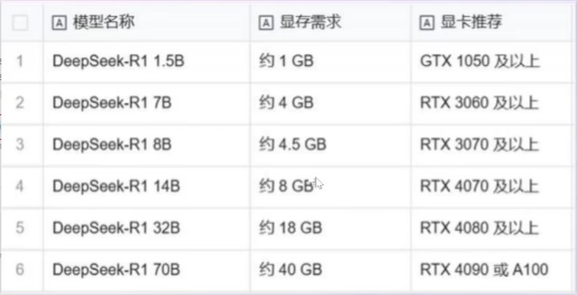
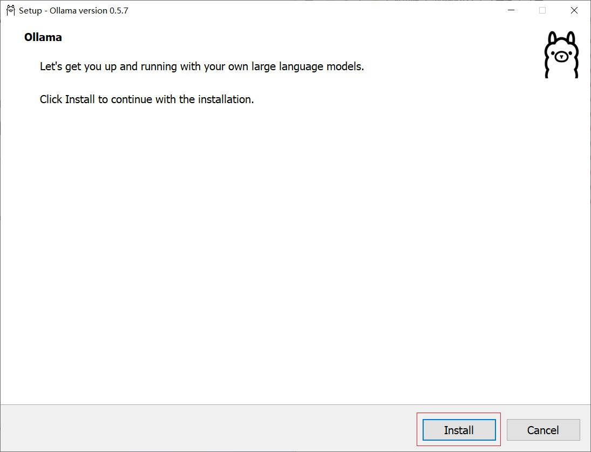
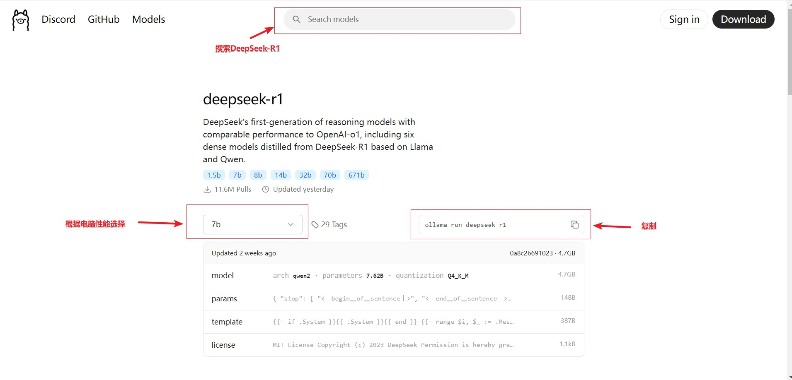
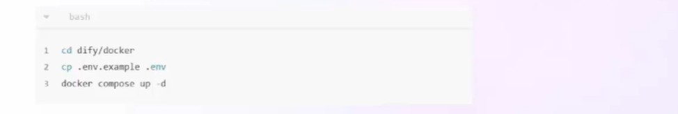
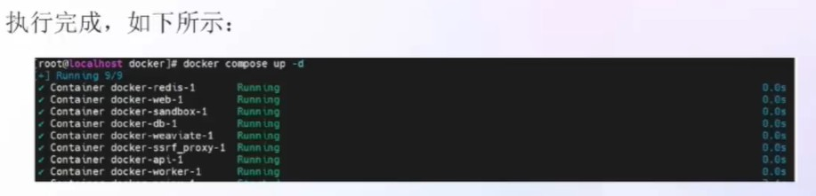
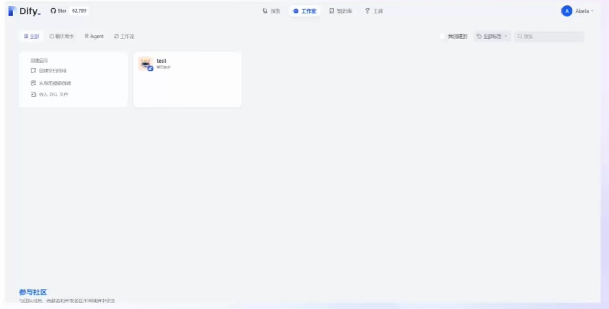
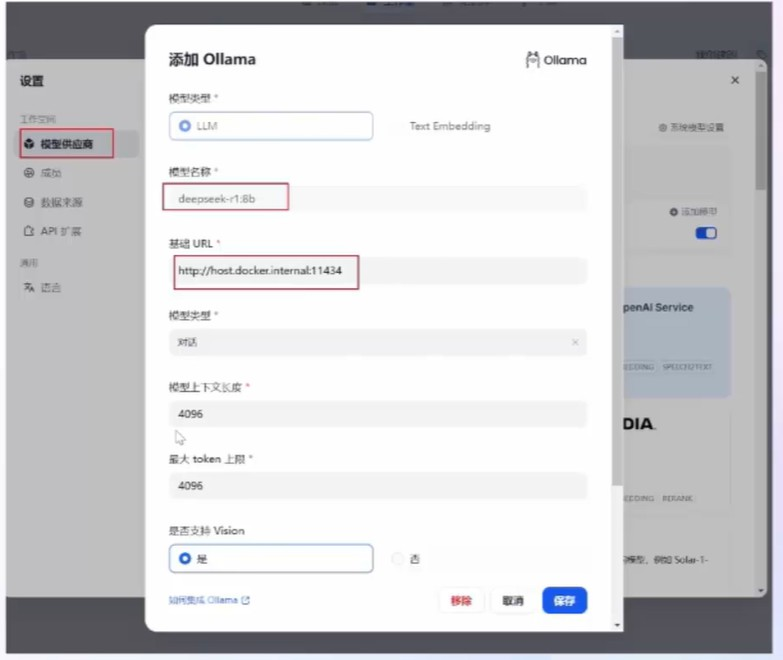
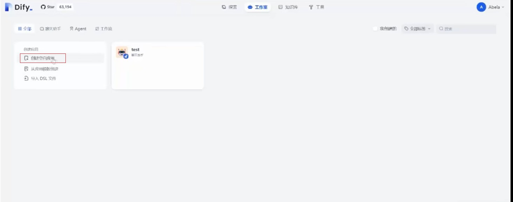
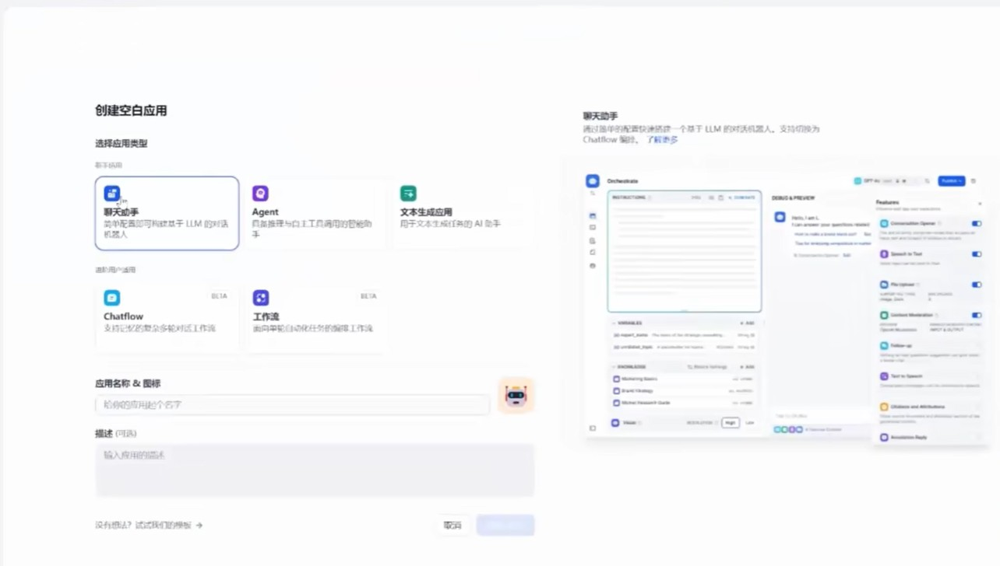
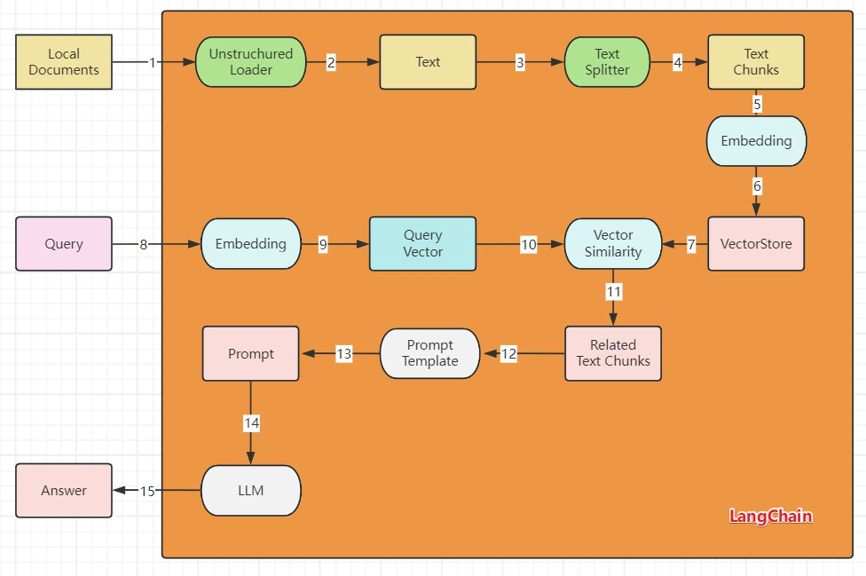

# Deepseek学习

## 1.Deepseek平台应用

### 1.1 了解Deepseek-V3

```
* Deepseek-V3模型在性能上全面对标海外领军闭源模型，生成速度也大幅提升，成为当前最强大的开源基础模型之一。

* Deepseek-V3是一款拥有671B参数的大型混合专家(MoE)模型，其中每个token会有37B参数被激活。
```

### 1.2 了解DeepSeek-R1

```
* DeepSeek-R1在性能上全面对齐OpenAI o1正式版，并开放了思维链输出功能。
* DeepSeek还宣布将模型开源license统一变更为MIT许可证，并明确用户协议允许“模型蒸馏”，进一步拥抱开源，促进技术共享
```

### 1.3 应用

```
代码改写
代码解释
代码生成
内容分类
结构化输出
角色扮演(自定义人设)
角色扮演(情节续写)
散文写作
诗歌创作
文案大纲生成
宣传标语生成
模型提示词生成
中英文翻译专家
```

## 2.DeepSeek的本地部署

### 2.1 [访问Ollama官网](https://ollama.com/)

```
ollama是一个开源框架，作用是在本地机器上部署和运行大型语言模型(LLM)
```

### 2.2 配置DeepSeek-R1模型

```
找到DeepSeek-R1并根据电脑配置选择对应模型大小
```



### 2.3 安装DeepSeek

```
复制安装命令，在黑窗口进行下载
```

### 2.4 过程

步骤1


步骤2


步骤3



步骤4



步骤5

在黑窗口中执行ollama run deepseek-r1:8b 下载deepseek-r1

步骤6

每次执行也执行ollama run deepseek-r1:8b 

## 3.Dify+DeepSeek构建AI助手

### 	3.1 介绍

​        Dify是一个开源的大语言模型(Large Language Model，LLM)应用开发平台。它融合了后端及服务(Backend as a Service,BaaS)和LLMOps的理念，旨在帮助开发者，甚至是非技术人员，能够快速搭建和部署生成式AI应用程序。

​		Dify内置了构建LLM应用所需的关键技术栈，包括对数百个模型的支持、直观的Prompt编排界面、高质的RAG引擎、稳健的Agent框架、灵活的流程编排，并同时提供了一套易用的界面。

### 	3.2 Dify安装

#### 3.2.1 安装docker环境

#### 3.2.2 克隆Dify代码到本地： git clone https://github.com/langgenius/dify.git

#### 3.2.3 进入到源代码中的docker目录下，一键启动！





#### 3.2.4 在浏览器访问地址

#### 3.2.5 dify页面



#### 3.2.6 配置DeepSeek



#### 3.2.7 创建空白应用



#### 3.2.8 选中聊天助手



### 3.3 RAG本地知识库的构建

#### 	3.3.1 介绍

​         RAG（Retrieval-Augmented Generation，检索增强生成） 是一种结合了信息检索技术与语言生成模型的人工智能技术。该技术通过从外部知识库中检索相关信息，并将其作为提示（Prompt）输入给大型语言模型（LLMs），以增强模型处理知识密集型任务的能力，如问答、文本摘要、内容生成等。RAG模型由Facebook AI Research（FAIR）团队于2020年首次提出，并迅速成为大模型应用中的热门方案。

#### 	3.3.2 RAG知识库的构建

* 1.创建知识库。通过上传本地文件、导入在线数据或创建一个空的知识库.
* 2.指定分段模式。该阶段是内容的预处理与数据结构化过程，长文本将会被划分为多个内容分段。
* 3.设定索引方法和检索设置。知识库在接收到用户查询问题后，按照预设的检索方式在已有的文档内查找相关内容，提取出高度相关的信息片段供语言模型生成高质量答案。
* 4.完成上传，在应用内关联知识库并使用。

