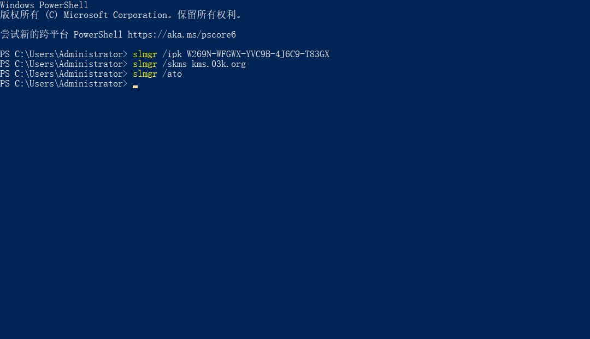

# 激活Window

```
1、鼠标右键点击开始图标，选择【windows powershell(管理员)】，或者命令提示符(管理员)；
2、打开命令窗口，复制这个命令slmgr /ipk W269N-WFGWX-YVC9B-4J6C9-T83GX，在命令窗口鼠标右键，会自动粘贴，按回车键执行，安装win10专业版密钥；
3、接着执行命令slmgr /skms kms.03k.org，设置kms服务器，kms服务器还可以是kms.03k.org等等，查看可用的kms激活服务器有哪些；
4、最后执行命令slmgr /ato，
```
