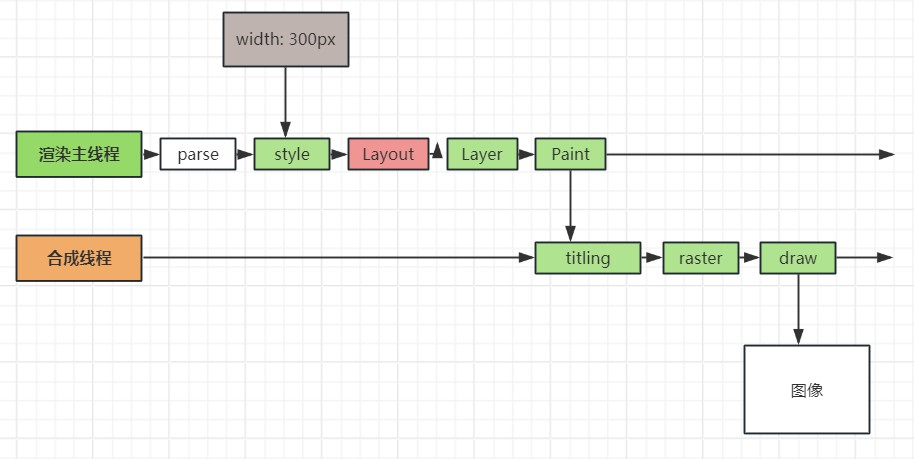
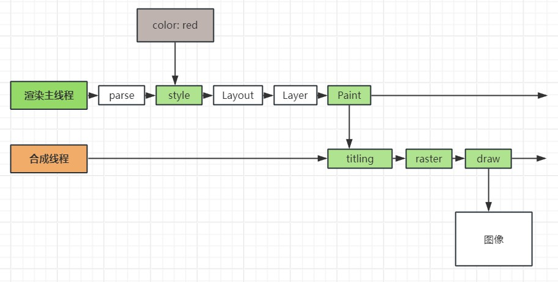
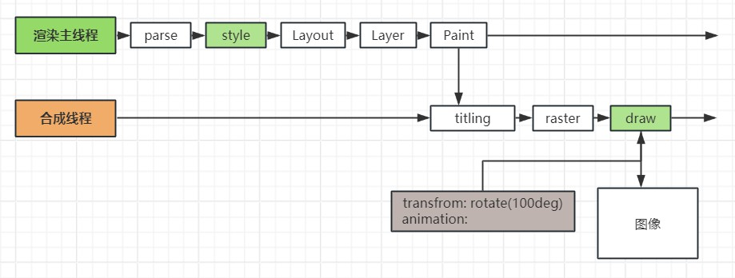

# 面试题

## 1. JavaScript

### 如何理解 JS 的异步？

```
JS是一门单线程的语言，这是因为它运行在浏览器的渲染主线程中，而渲染主线程只有一个。
而渲染主线程承担着诸多的工作，渲染页面、执行 JS 都在其中运行。
如果使用同步的方式，就极有可能导致主线程产生阻塞，从而导致消息队列中的很多其他任务无法得到执行。这样一来，一方面会导致繁忙的主线程白白的消耗时间，另一方面导致页面无法及时更新，给用户造成卡死现象。
所以浏览器采用异步的方式来避免。具体做法是当某些任务发生时，比如计时器、网络、事件监听，主线程将任务交给其他线程去处理，自身立即结束任务的执行，转而执行后续代码。当其他线程完成时，将事先传递的回调函数包装成任务，加入到消息队列的末尾排队，等待主线程调度执行。
在这种异步模式下，浏览器永不阻塞，从而最大限度的保证了单线程的流畅运行。
```

### 阐述一下 JS 的事件循环

```
事件循环又叫做消息循环，是浏览器渲染主线程的工作方式。
在 Chrome 的源码中，它开启一个不会结束的 for 循环，每次循环从消息队列中取出第一个任务执行，而其他线程只需要在合适的时候将任务加入到队列末尾即可。
过去把消息队列简单分为宏队列和微队列，这种说法目前已无法满足复杂的浏览器环境，取而代之的是一种更加灵活多变的处理方式。
根据 W3C 官方的解释，每个任务有不同的类型，同类型的任务必须在同一个队列，不同的任务可以属于不同的队列。不同任务队列有不同的优先级，在一次事件循环中，由浏览器自行决定取哪一个队列的任务。但浏览器必须有一个微队列，微队列的任务一定具有最高的优先级，必须优先调度执行。
```

### JS 中的计时器能做到精确计时吗？为什么？

```
不行，因为：
计算机硬件没有原子钟，无法做到精确计时
操作系统的计时函数本身就有少量偏差，由于 JS 的计时器最终调用的是操作系统的函数，也就携带了这些偏差
按照 W3C 的标准，浏览器实现计时器时，如果嵌套层级超过 5 层，则会带有 4 毫秒的最少时间，这样在计时时间少于 4 毫秒时又带来了偏差
受事件循环的影响，计时器的回调函数只能在主线程空闲时运行，因此又带来了偏差
```

### 什么是 reflow？



```
reflow 的本质就是重新计算 layout 树。
当进行了会影响布局树的操作后，需要重新计算布局树，会引发 layout。
为了避免连续的多次操作导致布局树反复计算，浏览器会合并这些操作，当 JS 代码全部完成后再进行统一计算。所以，改动属性造成的 reflow 是异步完成的。
也同样因为如此，当 JS 获取布局属性时，就可能造成无法获取到最新的布局信息。
浏览器在反复权衡下，最终决定获取属性立即 reflow。
```

### 什么是 repaint？



```
repaint 的本质就是重新根据分层信息计算了绘制指令。
当改动了可见样式后，就需要重新计算，会引发 repaint。
由于元素的布局信息也属于可见样式，所以 reflow 一定会引起 repaint。
```

### 为什么 transform 的效率高？



```
因为 transform 既不会影响布局也不会影响绘制指令，它影响的只是渲染流程的最后一个「draw」阶段
由于 draw 阶段在合成线程中，所以 transform 的变化几乎不会影响渲染主线程。反之，渲染主线程无论如何忙碌，也不会影响 transform 的变化。
```

