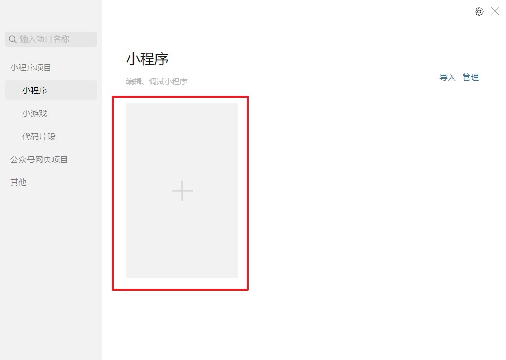
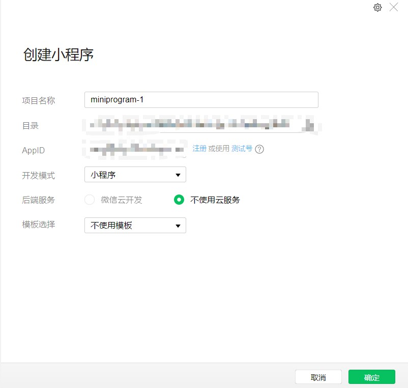
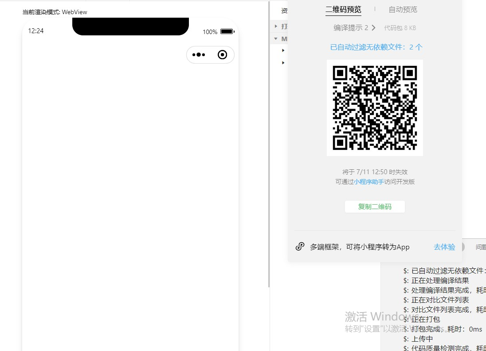

# 小程序开发

## 一、小程序和普通网页开发区别

```
1.运行环境不同
	网页:浏览器环境
	小程序：微信环境
	
2.API不同
 	在小程序中，无法调用浏览器的DOM和 BOM API
 	存在的可以调用微信环境提供的API：微信支付、微信扫描、地理定位
 	
3.开发模式不同
	页面开发模式：代码编辑器 + 浏览器
	小程序有自己的标准开发模式
		a.申请小程序开发账号
		b.安装小程序开发者工具
		c.创建和配置并开发小程序项目
		d.上线到微信提供的环境当中
		
4.网页开发渲染线程和脚本线程是互斥的，这也是为什么长时间的脚本运行可能会导致页面失去响应。在小程序中，二者是分开的，分别运行在不同的线程中。
 
5.运行机制
	a.小程序启动
		把小程序的代码包下载到本地
        加载app.json全局配置文件
        执行app.js小程序入口文件，调用APP()创建小程序实例
        渲染小程序首页
        小程序启动完成   
	b.页面渲染
		加载页面的.json配置文件
        加载页面的.wxml模板和.wxss样式
        执行页面的.js文件，调用Page()创建页面实例
        页面渲染完成
```

## 二、注册小程序开发账号

```
1.打开小程序注册页面https://mp.weixin.qq.com/
2.选择注册的账号类型
3.填写账号信息
4.邮箱激活
```

## 三、下载微信开发者工具

```
1.了解微信开发者工具(小程序开发工具)

2.主要功能：
	-创建小程序项目
	-代码查看编辑
	-小程序功能的开发和调试
	
3.下载并安装微信开发者工具
	-推荐下载和安装最新的稳定版stable build 的微信开发者工具
	-微信开发者工具[地址](https://developers.weixin.qq.com/miniprogram/dev/devtools/download.html)
	-安装方式： 下一步 -> 下一步

4.扫码登录开发者工具

5.设置外观

6.设置代理
	-尽量设置成不使用任何代理，勾选后直连网络
	-原因：安装网络加速或者翻墙工具导致网络不稳定
```

## 四、创建项目			

### 1.点击+号，创建项目

### 2.填写项目信息



### 3.预览效果展示


## 五、小程序项目构成

```
1.项目构成
    pages                 存放所有小程序页面的
    utils                 用来存在工具性的模块
    app.js                小程序的入口文件
    app.json              小程序项目的全局配置文件
    app.wxss              小程序项目全局样式文件
    project.config.json   项目的配置文件
    sitemap.json          用于配置小程序及其页面是否允许被微信索引

2.页面组成
    .js      页面脚本文件，定义页面的数据、事件、生命周期
    .json    页面的配置文件，配置页面的外观、表现
    .wxml    页面的模板结构
    .wxss    页面的样式文件

3.初始页面的定义
 	-配置 "entryPagePath": "pages/index/index",
    -不配entryPagePath,"pages"中第一和就是初始页面
```


## 六、WXML的概念以及和HTML之间的区别

```
1.什么是wxml
wxml是框架设计的一套标签语言(组件)，用来构建小程序页面的结构，其作用类似于网页开发中的html
2.wxml和html的区别
  标签名不同、标签属性不同、提供了类似于vue的模板语法
```

## 七、WXSS的概念以及css之间的区别

```
1.什么是wxss
wxss是一套样式语言，用于描述wxml的组件样式，类似于css
2.wxss和css区别
  新增rpx自适应尺寸单位
  	css中需要手动进行像素单位转换
  	wxss在底层支持新的尺寸单位rpx，在不同大小的屏幕上小程序会自动进行换算
  提供了全局的样式和局部样式
  	项目根目录中的app.wxss会作用于所以小程序页面
  	局部页面的.wxss样式仅对当前页面生效
  wxss支持部分css选择器
  	.class和#id
  	element(标签选择器)
  	并集选择器和后代选择器
  	::after和::before等伪类选择器
```

## 八、小程序中的js文件分类为三大类：

```
1.app.js  是整个小程序项目的入口文件，通过调用App()函数，来启动小程序
2.页面的.js文件  是页面的入口文件，通过调用Page()函数来创建小程序页面，并运行小程序页面
3.普通的.js文件  是普通的功能模块文件，用来封装公共的函数或属性共
```

## 九、宿主环境

```
1.宿主环境的概念
	宿主环境是程序运行的环境，Android和ios系统是两个不同的宿主环境

2.小程序的宿主环境
	小程序借助宿主环境提供的能力，可以完成许多网页不能的功能 (微信扫码、微信支付、微信登录、地理定位)

3.小程序的宿主环境包含
	通信模型、运行机制、组件、API
	
4.小程序通信模型
	a.通信主体
		主体是渲染层和逻辑层，其中:
			(1)wxml模型和wxss样式工作在渲染层
			(2)js脚本工作在逻辑层
	b.工作方式
		(1)渲染层和逻辑层之间的通信      由微信客户端进行转发
		(2)逻辑层和第三方服务器之间通信   微信客户端进行转发
```

## 十、小程序中的组件

### 1.[常见使用容器组件](https://developers.weixin.qq.com/miniprogram/dev/component/)

```
视图容器、基础内容、表单组件、导航组件、媒体组件、map地图组件、canvas画布组件、开发能力、无障碍访问
```

### 2.常见的视图组件

#### 	2.1view组件

```
1.介绍
	普通视图区域
	类似于HTML中的div，是块级元素
	常用来实现页面布局效果
```

#### 	2.2scroll-view组件

```
1.介绍
	可滚动的视图区域
	常用来实现滚动列表

2.使用
<scroll-view  scroll-y></scroll-view>  竖轴滚动必须设置高度
```

#### 	2.3swiper和swiper-item

```css
1.介绍
	轮播图容器组件和轮播图item组件

2.使用
  在wxml中
   <swiper class='swiper_box' interval='500' autoplay	circular indicator-dots>
    <swiper-item>
      <view class="swiper_item_box box1">1</view>
    </swiper-item>
    <swiper-item>
      <view class="swiper_item_box box2">2</view>
    </swiper-item>
    <swiper-item>
      <view class="swiper_item_box box3">3</view>
    </swiper-item>
   </swiper>
  在wxss中
	.swiper_box{
      width: 100px;
      height: 100px;
    }
    .swiper_item_box {
      height: 100px;
      width: 100px;
      display: flex;
      justify-content: center;
      align-items: center;
    }
    .box1 {
      background: greenyellow;
    }
    .box2 {
      background: blue;
    }

    .box3 {
      background: red;
    }
```

### 3.常见的基本内容组件

#### 	3.1text组件

```vue
1.介绍
	文本组件类似于HTML中的span标签，是个行内元素

2.使用
	<text user-select>111111111111111</text>
```

#### 	3.2rich-text组件

```vue
1.介绍
	富文本组件,支持把HTML字符串渲染为WXML结果

2.使用
	<rich-text nodes="<h2 style='color:red; background-color:blue;'>表情内容</h2>"></rich-text>
```

### 4.表单组件

#### 	4.1button按钮组件

```vue
1.介绍
	按钮组件:功能比HTML的button更丰富,通过open-type属性可以调用微信提供的各种功能

2.使用
	 <button type="warn" size="mini" plain loading>123</button>
	 //type  按钮的样式  primary 绿色/default 白色/warn 红色
	 //size  按钮的大小 default 默认大小/mini 小尺寸
	 //plain 按钮是否镂空，背景色透明
```

### 5.媒体组件

#### 	5.1image图片组件

```
1.介绍
	展示图片组件
	
2.使用
	<image src="../images/2.jpg" mode="widthFix"></image>
	//src  主持本地和网络上的图片
	//mode 指定图片的剪裁、缩放模式
		scaleToFill	缩放模式，不保持纵横比缩放图片，使图片的宽高完全拉伸至填满 image 元素	
		aspectFit	缩放模式，保持纵横比缩放图片，使图片的长边能完全显示出来。也就是说，可以完整地将图片显示出来。	
		aspectFill	缩放模式，保持纵横比缩放图片，只保证图片的短边能完全显示出来。也就是说，图片通常只在水平或垂直方向是完整的，另一个方向将会发生截取。	
		widthFix	缩放模式，宽度不变，高度自动变化，保持原图宽高比不变	
		heightFix	缩放模式，高度不变，宽度自动变化，保持原图宽高比不变	2.10.3
		top	裁剪模式，不缩放图片，只显示图片的顶部区域。仅 Webview 支持。	
		bottom	裁剪模式，不缩放图片，只显示图片的底部区域。仅 Webview 支持。	
		center	裁剪模式，不缩放图片，只显示图片的中间区域。仅 Webview 支持。	
		left	裁剪模式，不缩放图片，只显示图片的左边区域。仅 Webview 支持。	
		right	裁剪模式，不缩放图片，只显示图片的右边区域。仅 Webview 支持。	
		top left	裁剪模式，不缩放图片，只显示图片的左上边区域。仅 Webview 支持。	
		top right	裁剪模式，不缩放图片，只显示图片的右上边区域。仅 Webview 支持。	
		bottom left	裁剪模式，不缩放图片，只显示图片的左下边区域。仅 Webview 支持。	
		bottom right	裁剪模式，不缩放图片，只显示图片的右下边区域。仅 Webview 支持。
```

## 十三、协调工作

### 1.项目成员(运营者、开发者、数据分析者)

### 2.体验成员

## 十四、上传小程序

## 十五、小程序码及线下物料下载


