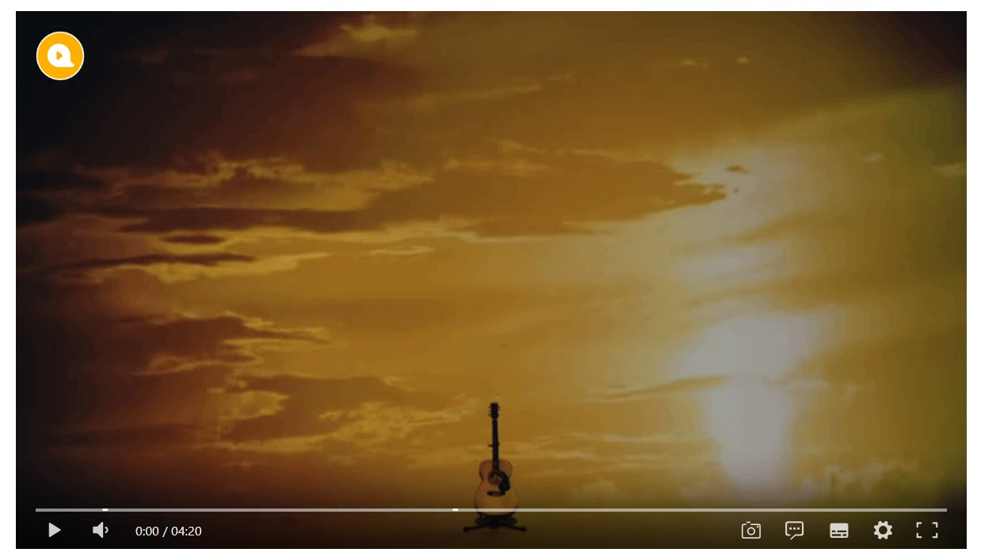

# 视频播放

## 效果


## 代码
<<< @/docs/.vuepress/components/Videoplayer.vue

## [地址](https://dplayer.diygod.dev/zh/)

## 下载依赖

```
npm i dplayer -S
```

## 事件绑定

```
dp.on（event, handler）事件：
    play: DPlayer 开始播放时触发 
    pause: DPlayer 暂停时触发 
    canplay: 在有足够的数据可以播放时触发 
    playing: DPlayer 播放时定期触发 
    ended: DPlayer 结束时触发 error: 发生错误时触发
```

## 参数

| 名称              | 默认值                             | 描述                                                         |
| ----------------- | ---------------------------------- | ------------------------------------------------------------ |
| container         | document.querySelector('.dplayer') | 播放器容器元素                                               |
| live              | false                              | 开启直播模式                                                 |
| autoplay          | false                              | 视频自动播放                                                 |
| theme             | '#b7daff'                          | 主题色                                                       |
| loop              | false                              | 视频循环播放                                                 |
| lang              | navigator.language.toLowerCase()   | 可选值: 'en', 'zh-cn', 'zh-tw'                               |
| screenshot        | false                              | 开启截图，如果开启，视频和视频封面需要开启跨域               |
| hotkey            | true                               | 开启热键                                                     |
| preload           | 'auto'                             | 预加载，可选值: 'none', 'metadata', 'auto'                   |
| volume            | 0.7                                | 默认音量，请注意播放器会记忆用户设置，用户手动设置音量后默认音量即失效 |
| logo              | -                                  | 在左上角展示一个 logo，你可以通过 CSS 调整它的大小和位置     |
| apiBackend        | -                                  | 自定义获取和发送弹幕行为，详情                               |
| video             | -                                  | 视频信息                                                     |
| video.url         | -                                  | 视频链接                                                     |
| video.pic         | -                                  | 视频封面                                                     |
| video.thumbnails  | -                                  | 视频缩略图，可以使用 DPlayer-thumbnails 生成                 |
| video.type        | 'auto'                             | 可选值: 'auto', 'hls', 'flv', 'dash', 'webtorrent', 'normal' 或其他自定义类型 |
| video.customType  | -                                  | 自定义类型                                                   |
| subtitle          | -                                  | 外挂字幕                                                     |
| subtitle.url      | required                           | 字幕链接                                                     |
| subtitle.type     | 'webvtt'                           | 字幕类型，可选值: 'webvtt', 'ass'，目前只支持 webvtt         |
| subtitle.fontSize | '20px'                             | 字幕字号                                                     |
| subtitle.bottom   | '40px'                             | 字幕距离播放器底部的距离，取值形如: '10px' '10%'             |
| subtitle.color    | '#fff'                             | 字幕颜色                                                     |
| danmaku           | -                                  | 显示弹幕                                                     |
| danmaku.id        | required                           | 弹幕池id，必须唯一                                           |
| danmaku.api       | required                           | -                                                            |
| danmaku.token     | -                                  | 弹幕后端验证 token                                           |
| danmaku.maximum   | -                                  | 弹幕最大数量                                                 |
| danmaku.addition  | -                                  | 额外外挂弹幕                                                 |
| danmaku.user      | 'DIYgod'                           | 弹幕用户名                                                   |
| danmaku.bottom    | -                                  | 弹幕距离播放器底部的距离，防止遮挡字幕，取值形如: '10px' '10%' |
| danmaku.unlimited | false                              | 海量弹幕模式，即使重叠也展示全部弹幕，请注意播放器会记忆用户设置，用户手动设置后即失效 |
| contextmenu       | []                                 | 自定义右键菜单                                               |
| mutex             | true                               | 互斥，阻止多个播放器同时播放，当前播放器播放时暂停其他播放器 |

